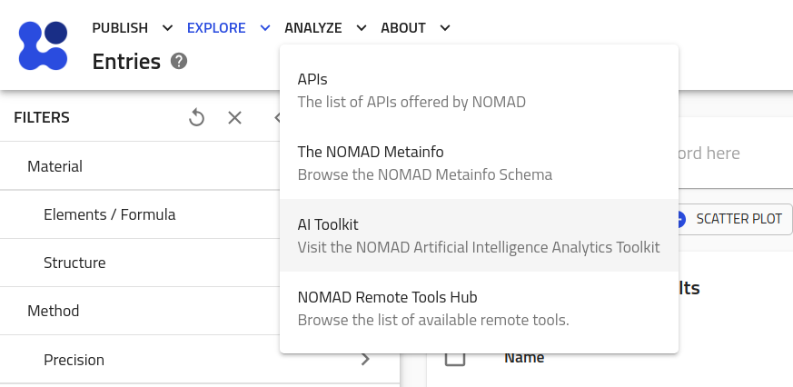

# The AI Toolkit

The [Artificial-Intelligence Toolkit](https://nomad-lab.eu/aitoolkit) is a collection of tools and tutorials for applying artificial-intelligence approaches (including machine-learning, compressed sensing, and data mining) to the materials data found on the NOMAD repository.

Currently, the AI-toolkit focuses on analysis of *Ab Initio* data. This focus will be broadened as a larger amount of MD data is added to NOMAD. In the mean time, the toolkit still provides a nice platform for learning about state-of-the-art data analysis techniques in the context of materials data.

<!-- You can reach the toolkit by going to "Analyze > AI Toolkit" in the top-left menu on the NOMAD page  You can navigate to the AI toolkit. The specifics of the toolkit is beyond the scope of this tutorial. However, we encourage you to explore its features on your own.

    <label>
        <input type="checkbox">
        
    </label>

 -->

    <label>
        <input type="checkbox">
        
    </label>

