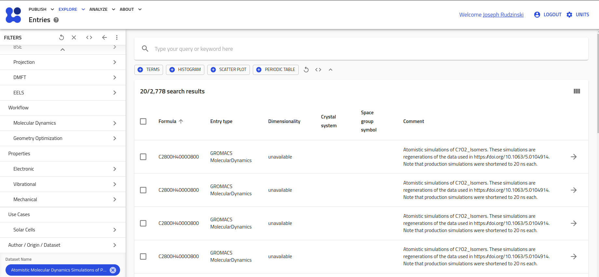
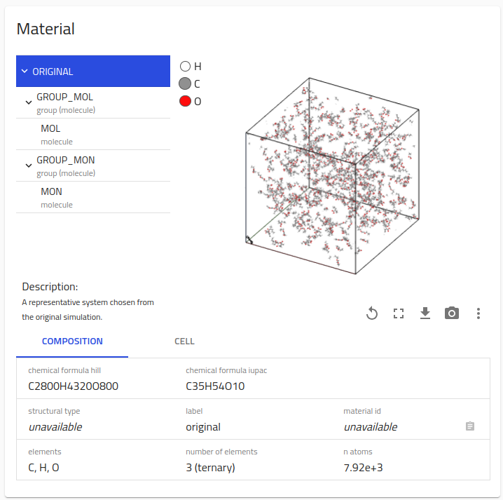
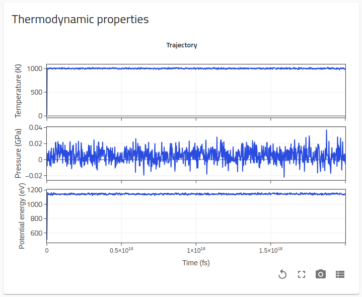
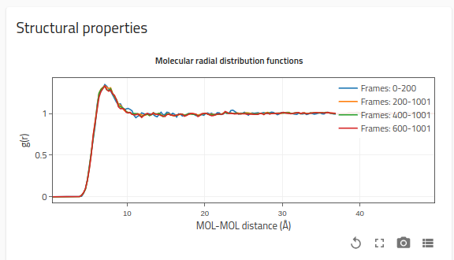
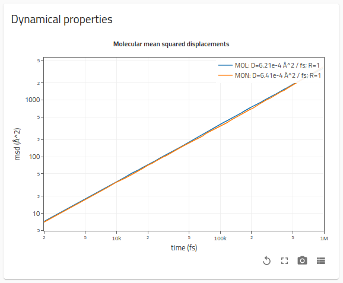
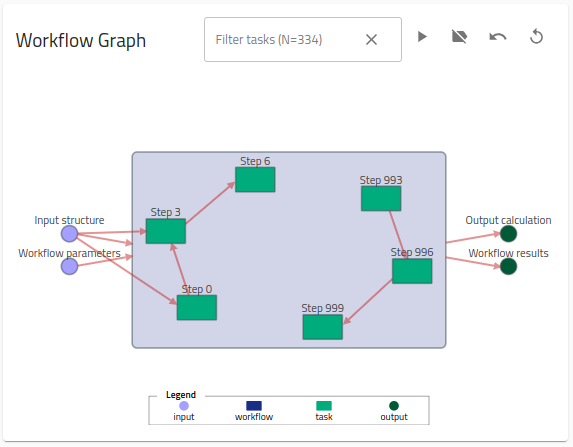
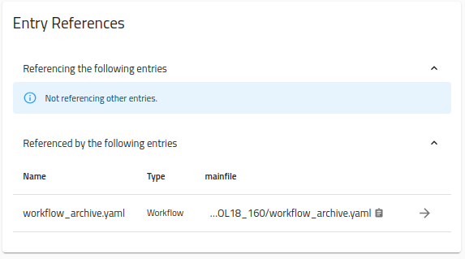
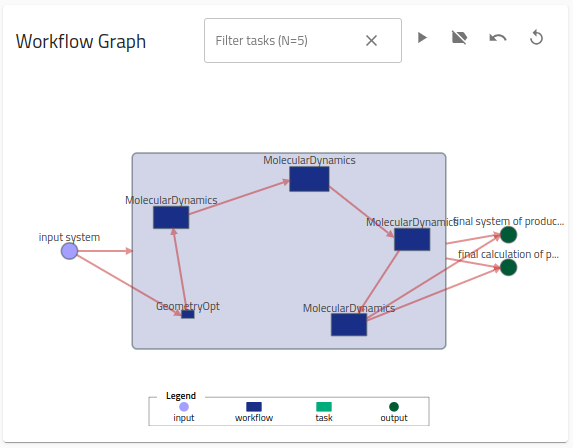

# The Molecular dynamics overview page and workflow visualizer (~40 min)

In this section, we will explore futher the features of the overview page. Let's first find some MD data to investigate. Go to `Explore > Entries` from the top-left menu on the main (beta) NOMAD page. Go to the `Molecular Dynamics` tab on the `Filters` menu (left-hand side) and select `Temperature` under Available Properties. Now, go to the `Author / Origin / Data` filter tab. Under `Dataset Name`, select `Atomistic Molecular Dynamics Simulations of Pure Liquid...`. Now under results, select any entry in this dataset by clicking the :fontawesome-solid-arrow-right: to the right of the entry.

    <label>
        <input type="checkbox">
        
    </label>

You are now on the _overview page_ of the selected entry, which is split into several "cards" with information about the simulation stored in this entry. At the top is the **`Material`** card, which contains a visualization of the simulation box along with some basic composition and cell (i.e., box) information. The visualizer also contains a "topology toggle bar". The MD parsers in NOMAD use the bond information from the force field to create a hierarchy of molecular and chemical-fragment organization for the system. In this way, we quickly understand the molecular composition and physical state of the system.

    <label>
        <input type="checkbox">
        
    </label>

The `Original` tab of the topology bar displays information about the entire system. Now click on the `Group_MOL` tab. Notice some molecules have been made transparent in the visualizer. This group represents all molecules called `MOL` in the simulation box. Similarly, the `Group_MON` tab represents groups of molecules called `MON`. By toggling between these tabs, we can see that this simulation is a binary mixture that is well-mixed. Notice also that the `Composition` table below the visualizer updates when different topology bar tabs are selected. Underneath each of these molecular groups, you will find a tab with the respecitve name of each molecule. When you click these tabs, a single representative molecule will appear to show the molecular structure.

The next card for these simulations is for **`Thermodynamic properties`**. Here we find plots of the time trajectories of various thermodynamic quantities: temperature, pressure, and potential energy in this case. Based on this information, what kind of simulation is contained within this entry (e.g., NVT, NPT, Simulated Annealing, etc.)?

    <label>
        <input type="checkbox">
        
    </label>

Now, scroll down to the **`Structural properties`** card. Once a molecular dynamics workflow is detected, the NOMAD software automatically tries to calculate radial distribution functions (rdfs) as a function of the molecular center of mass for each unique pair of molecule types. These rdfs are determined for various intervals of the trajectory, as a zeroth order measure of equilibration. Depending on the what type of simulation you have chosen, you may find that the rdfs are changing substantially during the simulation or are fully converged.

    <label>
        <input type="checkbox">
        
    </label>

Scroll down to the **`Dynamical properties`** card. Similar to the rdfs, NOMAD also calculates the molecular mean squared displacements (msds) for each molecule type. (Note that this requires at least 50 time frames present in the trajectory). A simple linear fitting procedure over the entire resulting msd curve is performed to determine the diffusion constant (displayed in the legend along with the corresponding *Pearson correlation coefficient*).

    <label>
        <input type="checkbox">
        
    </label>

??? tip
    For processing efficiency, the calculation of rdfs and msds will be skipped for molecule groups containing more than 50k molecules, and the calculation of msds additionally require at least 50 trajectory frames.

Scoll down to the **`Workflow Graph`** card. Here you find an interactive workflow graph that illustrates the workflow for this entry (i.e., a serial MD simulation). For workflows with many steps, only the first and last few tasks will be displayed. There are a number of known workflows, such as MD simulations, that are recognized by the NOMAD parsers, which then populate the workflow section of the NOMAD archive automatically.

    <label>
        <input type="checkbox">
        
    </label>

??? tip
    Clicking on the individual tasks will take you inside of that task to show the corresponding inputs and outputs. Use the back button to return to the entire workflow. Clicking on the text labels will take you to the location where this information is stored within the NOMAD archive (i.e., in the Data tab of this entry).

In addition to these standard workflows, users can also upload custom workflows, which can be used to connect various uploaded entries. You can examine an example of this by scrolling down to the **`Entry References`** card. Click on "Referenced by the following entries". You should see a single entry called "workflow_archive.yaml". Go to this entry by clicking the :fontawesome-solid-arrow-right: to the right.

    <label>
        <input type="checkbox">
        
    </label>

You are now on the _overview page_ for a custom workflow that contains the previous entry under investigation. By clicking the `Files` tab at the top of the page, and then navigating to `preview`, you can examine the `yaml` file that stores the workflow information. To learn more about creating such custom workflows, follow [`Advanced > Creating custom workflows`](Advanced/part4.md).

On the _overview page_, we see another workflow graph, which illustrates a linear workflow consisting of a Geometry Opimization (i.e., energy minimization), followed by a series of 4 MD simulations.

    <label>
        <input type="checkbox">
        
    </label>

### <u> **Exercise** </u>

Investigate each of the entries contained in this workflow and provide a description of the corresponding simulation/calculation (for example, which ensemble? what temperature? is the system equilibrated? what phase is the system in?).

??? tip
    You can navigate to the individual overview pages by clicking the text label above each workflow task.

??? success

    1. GeometryOptimization - An energy minimization of nearly 8k steps. The system is in the gas phase (see visualization). Only the end configuration is stored.

    2. MolecularDynamics #1 - A high temperature NVT simulation of the mixture in the gas phase (see also rdfs now) at 1000k.

    3. MolecularDynamics #2 - An NVT annealing simulation to cool the system from ~1000 k to ~300 k. As the temperature cools, the molecules aggregate, as indicated by the growing peaks in the rdfs. However, the pressure remains low due to the (fixed) large box size.

    4. MolecularDynamics #3 - An NPT simulation, performed at ~300 k. Midway through the simulation there is a clear transition in the potential energy and an increase in the pressure, indicating that the box is contracting and the system is entering the liquid phase. This is validated through the rdfs, which become properly normalized to 1 at large distances later in the trajectory.

    5. MolecularDynamics #4 - A fully equilibrated NPT simulation.

