# Part I: Overview of the NOMAD Archive and Repository (~40 min)

We start the tutorial with a brief overview of the NOMAD Archive and Repository (in short, NOMAD-lab) A more general tutorial can be found in the [FAIRmat tutorial 1](https://www.fairmat-nfdi.eu/events/fairmat-tutorial-1/tutorial-1-home).

## Exploring NOMAD {#entries_section}

Go to the [NOMAD-lab website](https://nomad-lab.eu/nomad-lab/).

There are 2 main versions when exploring NOMAD-lab: 1. the [stable version](https://nomad-lab.eu/prod/v1/gui/search/entries) ("Open NOMAD" button at the top-right corner of the page), and 2. the [Beta version](https://nomad-lab.eu/prod/v1/staging/gui/search/entries) (`Beta/staging` link at the bottom-right of the page, or via `Solutions > NOMAD` in the top menu and then scrolling down).

    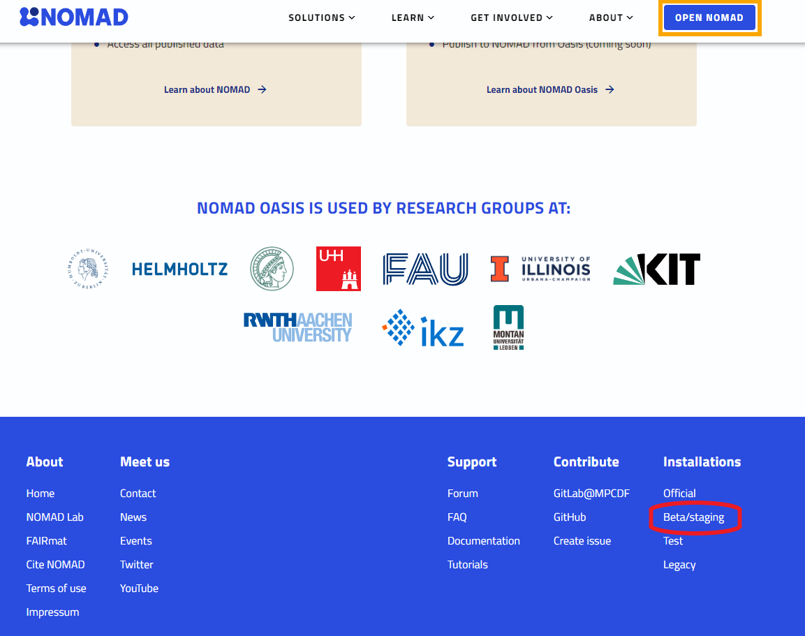
    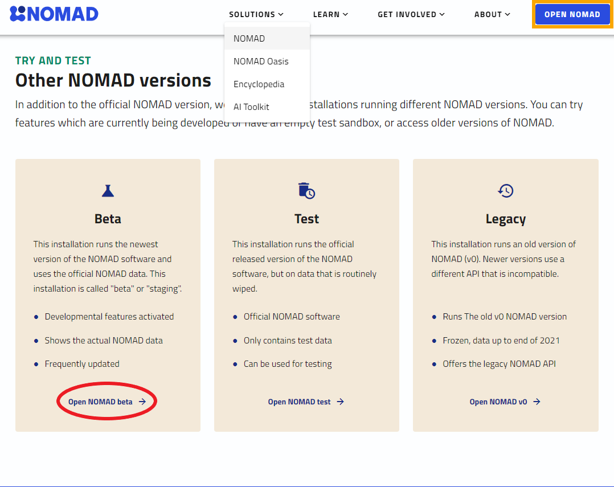 NOMAD.">

We recommend using the Beta version, since the NOMAD infrastructure is constantly being updated.

The landing NOMAD Entries page is a very intuitive and easy-to-use Graphical User Interface (GUI). Here you can explore data according to your preferences by clicking on the filter menus on the left. You can then select a variety of quantities that characterize the Material or system under study, the methodology parameters followed in the calculation or experiment, and the output properties.

    <label>
        <input type="checkbox">
        
    </label>

    <label>
        <input type="checkbox">
        
    </label>

<!-- There is a large variety of options to filter data in NOMAD. In this tutorial, you will learn about data for electronic-structure calculations, i.e., data obtained when solving Density Functional Theory (`DFT`), `GW` approximation, Bethe-Salpeter equation (`BSE`), projected tight-binding models (`Projection`), and Dynamical Mean-Field Theory (`DMFT`), as well as in the Properties menu called "Electronic". All of these menus contain (meta)information important for these calculations. If you feel some important quantity is missing, or maybe you want to extend to other electronic-structure techniques, please contact us! -->

To get you acquainted with the GUI search in NOMAD, we will be presenting you with a couple of _scenarios_, similar to how you might encounter them in your daily activities.
Each scenario starts with an _assignment box_ explaining the objective and listing the main skills you will acquire.
They then proceed with a step-by-step walkthrough, with the most essential steps highlighted in boldface.

There are several checkpoints along the way to ensure you stay on track.
These come in the shape of _tips_ and _success_ boxes, which you have to click to unfold.
Additional useful information that might be straying too off-topic is listed in _info_ boxes.
Reading them is optional for completing your task, but might deliver useful extra insights.
You can collapse them afterwards.
When the information contains strategies for steering clear from mistakes, it will be labeled as _warning_.
Each scenario assumes that you completed the previous ones, or that you are at least familiar with its objectives and terminology introduced.

With the structure clear, let us jump into the [NOMAD page](https://nomad-lab.eu/prod/v1/staging/gui/search/entries?upload_create_time[gte]=1419895487748&upload_create_time[lte]=1694679900000).
This link will take you to the staging version (latest release version), but only showing results up to September 14th, 2023.
The constraint ensures that you see the same results as those of the tutorial.

Take a look at the layout.
Some elements immediately stand out:

- In the middle, there is a whole list with tabulated data.
- Just above it is a search bar with the text "Type your query or keyword here".
- On the left-hand side is a "FILTERS" _side menu_.
- At the very top is a header with several options (left-hand side), login and units (right-hand).

As denoted at the top left, the page we have in front of us is called _Entries_.
When loading the page, you should also see an orange box in the left-bottom corner, warning you that you are using an experimental product. You can get rid of it by clicking the check mark (`✓`).
Now, let us move on to the actual scenarios.

### Scenario 1 - Example setup

!!! abstract "Assignment"
    **Imagine that you want to set up a Molecular Dynamics simulation of _water_ in _Gromacs_, and would like some examples to help you get started.
    For example, you may want to compare results from several setups to find the one most suitable to you.**

    In this exercise, you will learn how to:

    - navigate the "FILTERS" side menu.
    - toggle and combine filters.
    - work with dynamic statistics.

In the _entries list_ NOMAD is already listing all database _entries_.
The strategy is to **narrow or _filter_ this list down** to our needs.
Our main tool here, will be the _side menu_ (left-hand side).
Take stock of its structure.
There is a list of themes or _filter groups_.
Subgroups are indented below their main group.
Any **filter group with an arrow** (`>`) can be **clicked open** to reveal various filters and statistics in a _side pane_.
To **close the side pane** and reveal the full table again, use the **arrow back (`<-`)** in the top-left corner.
You could alternatively also click anywhere outside of the pane, but careful not to select anything unwanted.

Now, **scroll down to check out the full list**.
What main groups are there?
Remember, we essentially want to learn more about Gromacs and its calculation setup.
**Under which filter groups do you think we could find them?**

??? success
    While it is somewhat hidden, you can find the **"Program Name" under "Method"**.

This widget has a double function: it is both a filter and a statistic.
It comes with a text bar and a list of suggestions.
You can try extending the list further by clicking "SHOW MORE", but Gromacs is not the most well-represented code in our database.
Here, it is probably faster to just **type out the program name** and **hit enter**.

??? tip
    Almost all text bars in NOMAD support **autocomplete**.
    This comes in handy when you are unsure of the spelling or capitalization.
    Start with the first few letters and select your choice by clicking or hitting enter.

??? success
    You should be getting a result similar to the one in the reference picture.
    In the **side menu**, under "Method", you will find the **active filter "Program Name"** listed in grey, with its constraint / value **"GROMACS" denoted in a blue, oval _chip_**.

    

        <label>
            <input type="checkbox">
            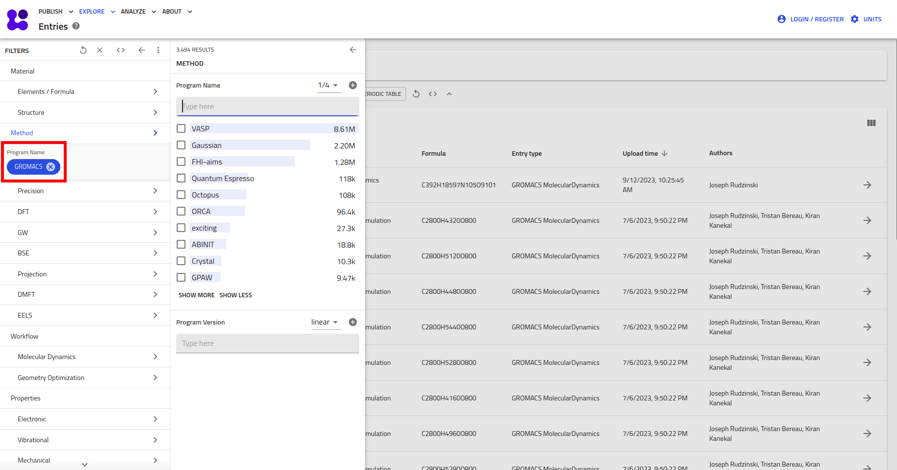
        </label>
    

Notice how the entries list changes with respect to your filter!
Yet, the list of remaining calculations is still quite long (3.496 matches)...
Most likely, there will not be a single filter that solves our problem completely.
That is alright, though, we can just **stack up several filters**.

??? tip
    If the filters are **not taking effect** right away, click the _redo button_ (`↺`) next to "FILTERS".
    It will manually trigger an update of the entries list and statistics.

    Likewise, to **reset all filters** and start with a clean slate, click on the _cancel button_ (`x`).
    Note that in the case of this tutorial, this also means removing the time constraint.
    Hence, if you decide to reset, the exact search results you see might start deviating from those in the tutorial.
    It is highly **recommended to follow the guide**.
    You can restore the [initial session](https://nomad-lab.eu/prod/v1/staging/gui/search/entries?upload_create_time[gte]=1419895487748&upload_create_time[lte]=1694679900000) by reloading.

The appropriate filter depends on your goals and priorities. Since we are interested in running a molecular dynamics simulation,
**go to the filter subgroup called "Molecular Dynamics", and click it open**.
You are now presented with several settings.
Judging from the statistics, we have the best chance with a setting that covers the widest range of calculations (28.000 entries).
**Select "Temperature" under "Available Properties"**. <!-- @Joseph: do you want me to to add a "Molecular Dynamics" selection button?-->

??? tip
    If you have trouble **understanding any term**, just **hover over** it with the mouse.
    A summary text will appear.
    For example, "Molecular Dynamics" > "Available Properties" clarifies that we are dealing with observables documented along the trajectory.

System specifications are found under "Material".
Since we know the composition of our system, **click on "Elements / Formula"**.
Notice how many of the elements on the periodic table are grayed out.
This indicates that there are no entries containing these elements, given the filters that you have applied.
Additionally, the **number of entries** containing each remaining element is displayed within the element's periodic table box, with a corresponding **blue color gradient**.

??? tip
    You can toggle the **statistics** scale via the dropdown menu to the right of the name.
    Conversely, if the statistics are ever slowing the browser down, deactivate them by deselecting "Filters" > "options menu" (`⋮`) > "Show advanced statistics".

Now, **select the elements** contained in our system (we are looking for pure water, so O and H suffice).
The corresponding chips will be added to the side menu, with an "and" in between.
While filters between groups _stack_ (i.e., **"and" logic** is applied), those within a side pane each have their own logic (more on that in scenario 2).
Finally, remove all data with additional elements by selecting the **"only compositions that exclusively contain these atoms"** box.

??? success
    You are left with 2 MD calculations in the entries list.
    **Clicking on the arrow (`->`)** of whichever entry will bring you to its _overview page_.
    More on that in [Part II - Overview page and workflows:](Tutorial-2_Overview_Page_and_Worfklow_Visualizer.md).
    By **clicking through on "FILES"**, you will get an overview of the uploaded files.
    These for sure contain **output**, but often also **input**.
    Both could serve as great starting points for deploying your own calculations.

    

        

            <label>
                <input type="checkbox">
                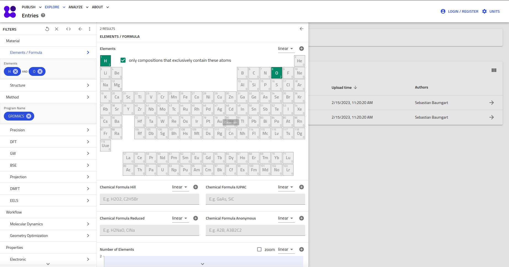
            </label>
        

        

            <label>
                <input type="checkbox">
                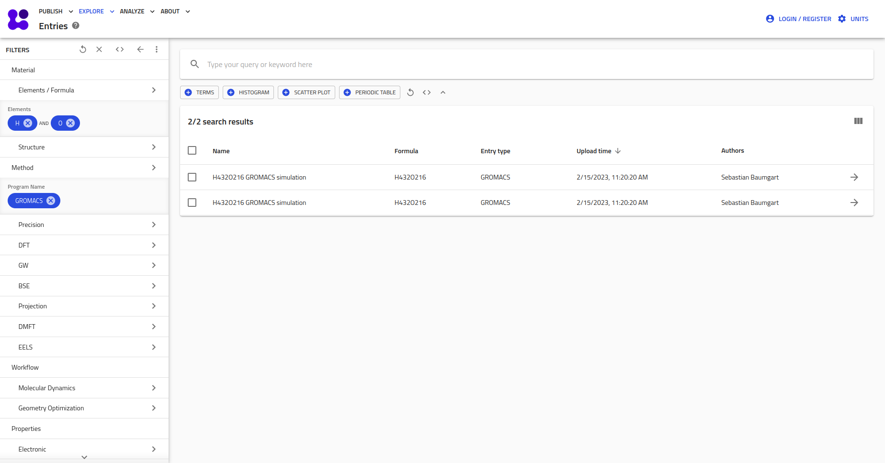
            </label>
        

        

            <label>
                <input type="checkbox">
                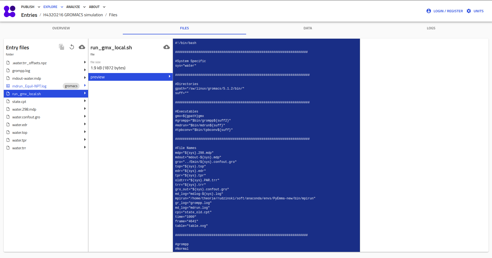
            </label>
        

    

Actually, the **order** in which we applied the filters **does not matter**.
In that sense, filters are like small questions or details that we use to construct an overall query.
<!-- This insight comes with a small caveat: the **statistics** that we see as we are stacking up our filters **are contingent on the history**.
If we take a different route, we will see different intermediate results and this could lead us to decide on different filters. -->
Let's go back to when we were selecting the relevant option under the Molecular Dynamics filter (click the `x` next to the `temperature chip` or go to **"Molecular Dynamics" > "Available Properties"** and **click the highlighted checkbox** again to deselect it).

??? success
    Glossing over the remaining 6 results, 3 by Jannik Mehlis and 3 by Sebastian Baugmart, we retrieve **2 more MD simulations** and **2 more "Geometry Optimizations"**.
    You may notice that some entries do not have a clear specification. <!-- @Joseph is this a bug? -->
    These entries likely need to be reprocessed to classify them correctly, since the molecular dynamics support has been developed more recently.
    However, you can still find out their classification by visiting the entry's overview page.

    While geometry optimization was not part of match our initial objective, these entries may inform us about the **overarching workflow** used by both authors, i.e., relaxing the system before the production simulation.
    Annotating such workflows is covered under [`Advanced > Creating custom workflows`](Advanced/part4.md).

    

        <label>
            <input type="checkbox">
            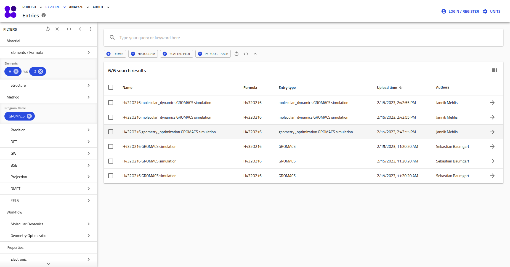
        </label>
    

<!-- placeholder note for Joseph option A -->
???+ info

    The upcoming scenarios **do not** deal with molecular dynamics data directly, due to lack of uploads.
    Nonetheless, they demonstrate useful features of the NOMAD repository, and *hopefully* motivate the increased use of NOMAD for molecular dynamics simulations.

### Scenario 2 - Data science

Start a fresh session by clearing the molecular dynamics related filters, or by restoring the [initial session](https://nomad-lab.eu/prod/v1/staging/gui/search/entries?upload_create_time[gte]=1419895487748&upload_create_time[lte]=1694679900000).

!!! abstract "Assignment"
    **You want to evaluate the impact of the metal used in _Metal Organic Frameworks_ (MOFs).
    Maybe, if you find enough high-quality data, you can even train a machine-learned model.
    Specifically, you are interested in predicting the band gap [^1].**

    [^1]: The band gap is the solid state counterpart of the HOMO-LUMO energy gap. Given that NOMAD is materials-centric (while still allowing molecular systems), it deals in condensed matter nomenclature. <!-- @Joseph: I could change the terminology here to "Band gap / HOMO - LUMO". That would make it more accessible to other communities as well. -->

    In this exercise, you will learn how to:

    - customize the entries table.
    - use the search bar.
    - recognize "OR" filter stacking.

    <!-- placeholder note for Joseph option B -->

In this scenario our objective is more vaguely defined, so we will **start by exploring** the database before focusing in.
A good overview is fundamental for spotting interesting data.
As you will have noticed, our main tool here is the **entries list** (supplemented by the statistics).
Unfortunately, the default columns (Entry "Name", the Hill "Formula", "Entry type", "Upload time", and "Authors") are not that helpful when exploring the _materials space_.
To **choose new columns**, **click on the three vertical slots** (`|||`) in the upper-right corner, opposite to "search results".
You will be presented with a checkbox menu of various quantities.
**Deselect**

- "Name": it contains similar information as "Formula" and "Entry Type" combined,
- "Upload time": we do not care for now about when the data was uploaded,
- "Author": dito,

and instead **select**

- "Dimensionality": to distinguish whether we are dealing with bulk, surface, or molecules.
- "Crystal system": the symmetry of the supercell.
- "Space group symbol": the symmetry of the atomic coordinates inside the supercell.
- "Comment": just to give us a bit more context, where possible.

The 3 first selections are quantities who's filters can all be found under "Material" > "Structure".
Let us furthermore **sort alphabetically by (Hill) "Formula"** by clicking on the "Formula" heading.
(Click multiple times to toggle between ascending / descending ordering).

???+ info "What are entries exactly?"
    Entries are individually stored data packages, shown as rows in the overview table.
    In our context, they mostly overlap with an _individual calculation_, e.g., a single-point calculation or a single molecular dynamics run.
    When separate calculations are linked together into a _workflow_ (see [`Advanced > Creating custom workflows`](Advanced/part4.md)), the overall link also receives its own dedicated entry.
    Lastly, since NOMAD covers the whole of Condensed Matter Physics and Chemistry, entries can also be _experimental samples_ or _batches_.

??? success
    You should now have a view in front of you similar to the reference figure.
    There is **little room for deviation**, since the **horizontal column order** is predetermined (matching the one in the selection box menu).
    Similarly, there can only be **one column for sorting** at a time.

    

        

            <label>
                <input type="checkbox">
                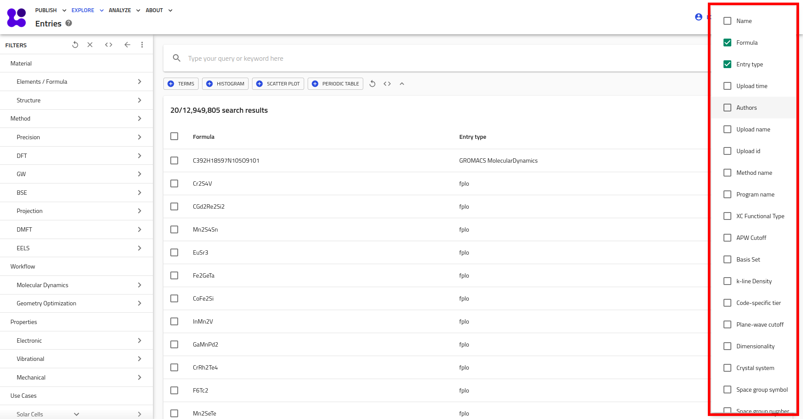
            </label>
        

        

            <label>
                <input type="checkbox">
                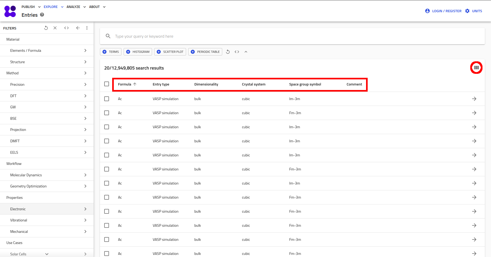
            </label>
        

    

With our entries view all set up, we move on to the **exploration** part.
More specifically, we will investigate the impact of several filters on our search.
You can follow along with the suggestions here, but feel free to also try out on your own.

While in the previous scenario we relied exclusively on the side menu, now that you are more familiar with the filters and their names, we can extend our toolkit with a **faster** alternative: the **search bar**.
Its main purpose is to aid you in composing **text-written filters** and avoid having to switch between side panes all the time.
The search bar does not, however, support the free-style natural language queries as found in web search engines, like Google, or AI models, like ChatGPT.
The formatting here is far stricter.
While you can switch back to the side menu at any time, we will , for educational purposes, rely on the search bar exclusively throughout this scenario.

???+ info "Optimade"
    NOMAD also supports the [Optimade](https://www.optimade.org/documentation) API, which has its own query conventions (not covered in this tutorial).
    To use the NOMAD-Optimade endpoint, scroll down to "Optimade" at the very bottom of the side menu.

We have a lot of leeway in which filters we tackle first.
As usual, it is best to start with the attributes that are **most clearly defined by our objective**.
In this case, it is that we are looking for **MOFs**.
From there on we will follow **the sequence: material; method; property**, just as you would when generating your own data.

Let us start again with the composition, or more specifically, by retrieving entries that contain carbon.
Locate the search bar (above the entries list) and **click into it to start typing**.
Try out a couple of keywords that come to your mind.
As you are typing, **NOMAD will autocomplete your query** with several suggestions.
Once you find a promising term, select it with the mouse or keyboard.
Then write a single (not double or triple) **equal sign (`=`)** and **fill in the value** to filter for.
Once you have it, press enter.
Congratulations, you have applied your first _equality query_.

??? tip
    When searching for elements, do not fall for the mistake of writing out their name.
    NOMAD, and especially its search bar, aims for efficiency.
    So just stick to the **elemental symbol** from the periodic table.
    Lowercase also works.

???+ info "What are these autocompleted filter names?"
    The full filter names that pop up in the suggestions are structured similarly to a _filepath_, but with dots (`.`) instead of slashes (`/` on Unix, `\\` on Windows).
    This is in line with the format of many other _document databases_.
    To explore this structure / _schema_, navigate to "ANALYZE" (in header) > "The NOMAD Metainfo".

??? success
    You should have found the query **"results.material.elements=C"**.
    Upon pressing enter, the same chip as usual appears in side menu, confirming that the filter is active.
    Moreover, note how the **filter name** in the side menu is contained in the the autocompleted version.

    

        

            <label>
                <input type="checkbox">
                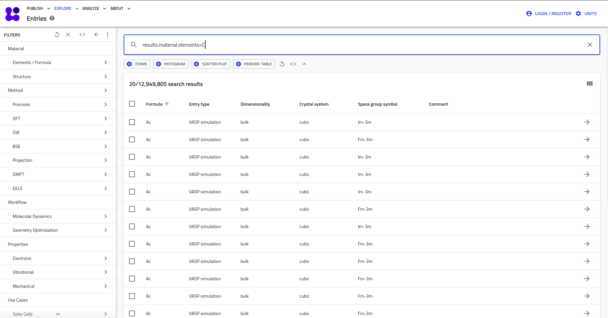
            </label>
        

        

            <label>
                <input type="checkbox">
                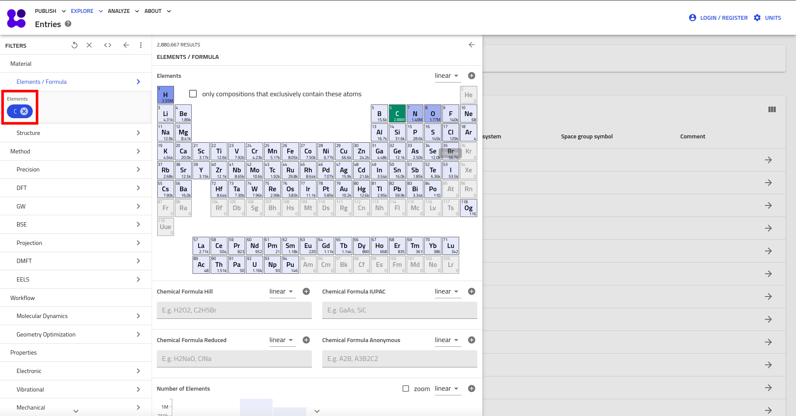
            </label>
        

    

As you saw, one can start out by writing the filter name, but you can just as well skip ahead to the value.
Just **type in  "H"** and **apply "results.material.elements=H"**.
NOMAD automatically recognizes that you might mean an element, at which point it is easy to guess the matching filter.
As such, we have refined our search to hydrocarbons, but MOFs also need ligands to bind the metal.
Using the search bar, further **stack oxygen and nitrogen filters**.
Note how the entries list changes.

While the formulae are approaching what we are looking for, they do not look like MOFs quite yet.
We already have enough elements for our skeleton / linkers, so let us just **add a metal** now.
Unfortunately, the NOMAD filters do not know this concept.
Instead, we will keep the last element a bit more open and just specify the number of elements.
**"Number of"** is often abbreviated as **"n_"** in NOMAD.
Type it into the search bar and select the appropriate filter name.
We want to constrain the formula, but let us keep room for a wild card, e.g. another metal or ligand constituent.
If it trouble us down the road, we can just tighten the filter.
So finish the _single inequality query_ with **"<=6"**.

The current query will leave room for systems without any metal atom, i.e. not MOFs.
**Recreate the previous query**, but hold off on pressing the enter key.
Rather, you should constrain it with a **lower limit** as well.
In particular, let's require at least 5 different elements.
You can add a lower limit by placing your **cursor at the beginning** and writing a similar comparison.
Like this, you have constructed the most complex search bar query, a _double inequality query_.

Finally, we are interested in the material in **bulk form** specifically, no interfaces of any kind.
**Use the search bar** to add this restriction.

??? success
    Your sandwiched LTE / GTE query should be either `4<results.material.n_elements<=6` or `5<=results.material.n_elements<=6`.
    Both yield the same results.
    Then you should also have added the equality query `results.material.structural_type=bulk`.

    

        <label>
            <input type="checkbox">
            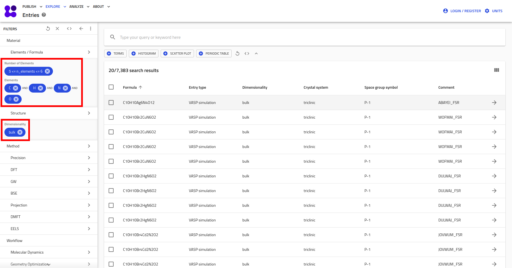
        </label>
    

    Most columns seem much more uniform now.
    This was to be expected for "Dimensionality", since we explicitly enforced homogeneity, but "Entry type", "Crystal system" and "Space group symbol" are also affected.
    Even "Comment" seems to be following a repetitive format.

    Most importantly, the formulae only vary in metal contributions.
    These definitely look like MOFs.
    You can verify this by opening the _entry overview_ of a row.
    Just click the arrow (`->`) right in the entries list.
    To return, use your browser's "go back" function.

For machine-learning, a **dataset** should be **homogeneous** across its entire setup, safe for the variables that we are interested in.
Most of the data on NOMAD is _Density Functional Theory_ (DFT), with some GW and classical forcefields.
GW would overall be better for high-quality band gaps, but DFT will end up being more useful due to its sheer number of entries.
Just as with forcefields, DFT is mostly determined by the choice of kernel, i.e. density functional.

Hybrid functionals are the norm for organic systems and the most popular in solid state by far are HSE06 and HSE03.
By now, you probably have a good instinct of where to find them in the side menu (under "DFT"), but let us stick with the search bar for practice.
Perform an **equality query** for both **"HSE03" and "HSE06"** (prominent hybrids in solid state).

???+ info "Density functional nomenclature"
    The functional naming in NOMAD follows the **convention established by [libxc](https://github.com/ElectronicStructureLibrary/libxc)**, a popular library for evaluating (semi)local functionals.
    In practice, this goes as `<hybrid flag>_<Jacob's Ladder>_<exchange-correlation part>_<name identifier>`, where **`<name identifier>` is the main ID** and the other tags simply provide metadata.
    `<hybrid flag>` is only present when the functional truly is a hybrid.

Hold on.
How can an entry contain 2 exchange-correlation functionals at once?
Are we maybe filtering for workflows that contain both?
For your answer, **take a look at the side menu**.

??? success
    Both "HYB_GGA_XC_HSE03" and "HYB_GGA_XC_HSE06" chips are present, but separated by the **connector "OR"** rather than "AND".
    Just as the name suggests, the logic condition is different in this case.
    Our "XC Functional Names" filter as not been narrowed down, but **extend to search for both** options.

    

        <label>
            <input type="checkbox">
            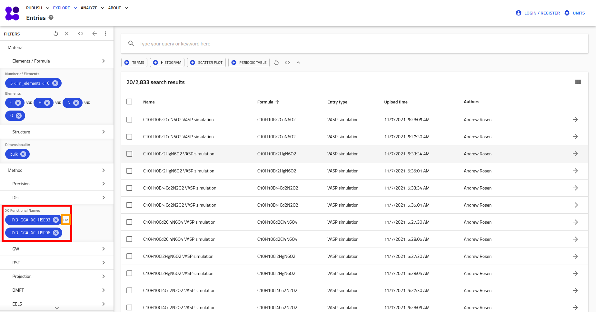
        </label>
    

    <!-- In practice, when doing **machine learning**, you would only choose a **single functional** (HSE06 in this case).
    The only exception would be _transfer learning_, but even then you are advised to split the functionals out over separate queries. -->
    Note: In practice you would only choose a **single functional** when doing **machine learning**. Here, we look for 2 functionals just for educational reasons.

???+ info "Multiple density functionals per entry"
    A single entry (and even calculation) may contain multiple functional names, just not `XC`!
    The libxc namely splits up _exchange-correlation_ functionals (`XC`) into _exchange_ (`X`) and _correlation_ (`C`), when appropriate.
    So for example, the most prominent functional in NOMAD, `PBE`, is stored as `[GGA_X_PBE, GGA_C_PBE]`.
    Note that selecting one of either or even both (due to the `OR` logic), does not guarantee a user will retrieve only PBE.

With the main method specified, there are still a bunch of additional numerical settings that may affect the fidelity of the results, such as the _basis set_.
These can all be found under the filter subgroup "Precision".
It is tough to estimate these parameters' actual impact.
Therefore, they are best left till the end of the full query.
Then you can evaluate the cost-benefit of reducing the dataset size for higher homogeneity or precision.
For a full rundown on these newer features, feel free to check out FAIRmat [Tutorial 10](https://www.fairmat-nfdi.eu/events/fairmat-tutorial-10/tutorial-10-home).
<!-- This feature is quite recent.
For it to have a significant impact, the NOMAD database has to run over all of 13 million entries and reprocess them.
In other words, new features will always lag behind in old data.
Please bear this in mind.
Since there are too few examples at the moment, we will skip this set of filters. -->

Lastly, we only want data that contains **the relevant observable**, the band gap.
Start by typing out **"band_gap"**.
Note how terms in the search bar never contain spaces, but **use underscores** (`_`) instead.
Click on the relevant suggestion.
If it does not fully match what you are looking for, feel free to shorten until it does.
To finish the _presence queries_, **add "=*"** and press enter.

??? tip
    To write an equality query for "*", use the escape character "\", i.e. "=\*".
    The escape character is not necessary for values containing, i.e. the radical "CH3*".
    Overall, there are very few instances of values "*" in NOMAD.

??? success
    The suggestions will present you with `results.properties.electronic.band_structure_electronic.band_gap.type` and `results.properties.electronic.band_structure_electronic.band_gap.value`.
    Both are a bit too deep down the search tree, since we are looking for `results.properties.electronic.band_structure_electronic.band_gap=*`.

    This filter yields a blank entries list.
    To understand why, examine the filter name: it targets only band gaps of band structure calculations.
    This is due to a legacy implementation, but has been mended.
    In the near future, this search will have many more hits.

This filter stack is too restrictive.
To work around this, remove the last filter and let us go with an alternative.
Formulate a presence query for the density of states, commonly abbreviated as DOS [^2].

??? success
    Your query should be `results.properties.electronic.dos_electronic=*` and return 2.833 entries.
    There is no need to narrow it down to spin-polarized calculations.
    We also accept spin-restricted data.

    [solutiuon link](https://nomad-lab.eu/prod/v1/staging/gui/search/entries?structural_type=bulk&n_elements[gte]=5&n_elements[lte]=6&xc_functional_names=HYB_GGA_XC_HSE03&xc_functional_names=HYB_GGA_XC_HSE06&upload_create_time[gte]=1419895487748&upload_create_time[lte]=1694679900000&quantities=results.properties.electronic.dos_electronic&elements=C&elements=H&elements=O&elements=N)

    

        

            <label>
                <input type="checkbox">
                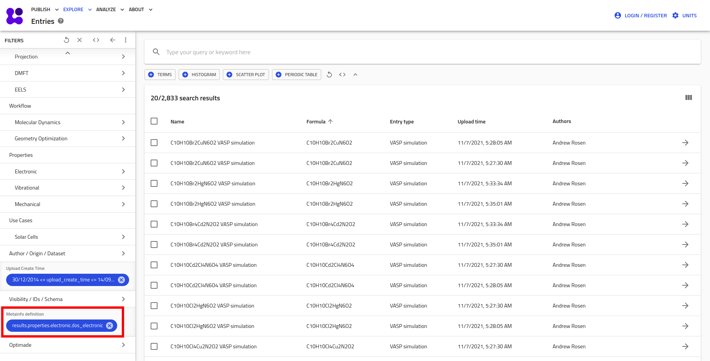
            </label>
        

        

            <label>
                <input type="checkbox">
                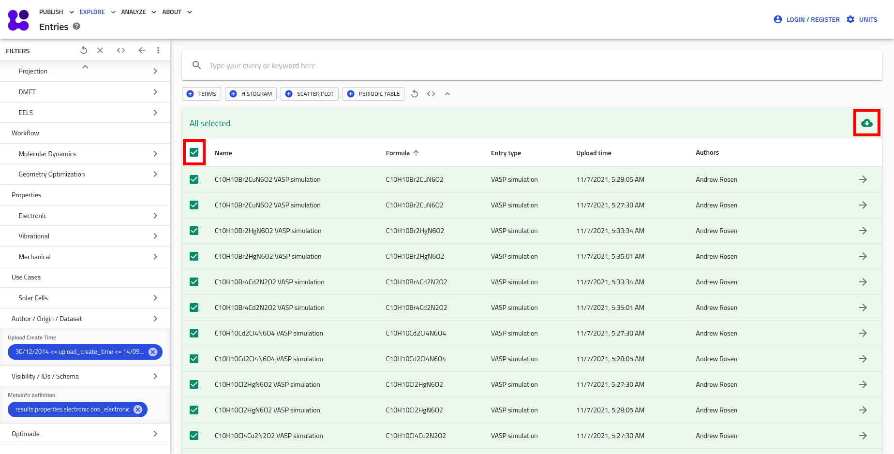
            </label>
        

    

!!! warning "When stacking order matters"
    Imagine having started filtering by property instead of composition and then method.
    You would have unwittingly excluded a vast dataset, potentially concluding that NOMAD does not host any suitable data.
    The **general strategy** to avoid working yourself in any of these dead ends is to start with **broad filters**, such as DOS instead of band gap.
    <!-- Overall, the order "Material", "Workflow", "Method", "Property", which mimics the actual progress of the computational results -->

    Also make sure to keep **monitoring relevant indicators** as you stack up filters.
    Even if you end up with unsatisfactory search results and start systematically removing filters, these indicators will be key in finding the best match.
    In the next scenario we will cover an even more powerful technique to aid in monitoring, _dashboards_.

    **Conclusion:** so-called _query engineering_ is not just limited to Large Language Models, but also applies to _sophisticated databases_.

From hereon, the best strategy would be to download the data you need, extract the band gap, and perform some statistical analysis first.
You might come across some new ideas on how to further hone your query and filter out more noise.
**Click the checkbox next to the column headers** in the entries list to select all entries.
The 3 vertical slots now change to a **download symbol**, given you the option between the original (raw) format or the **NOMAD format** (processed).
To save your query for future use, simply **bookmark the url**.

### Scenario 3 - Finding Publications

Go back again to the [initial session](https://nomad-lab.eu/prod/v1/staging/gui/search/entries?upload_create_time[gte]=1419895487748&upload_create_time[lte]=1694679900000).

!!! abstract "Assignment"
    **You are talking to a colleague about your machine-learned model (from scenario 2).
    They tell you about a good recent research publication they saw by the author Rosen, but are forgetting the rest of the details at the moment.
    They will get back to you, but you are eager to check it out right away.**

    In this exercise, you will learn how to:

    - filter by publication metadata.
    - set up a dashboard.
    - examine an entry summary.

The obvious starting point would be use a search engine specialized in publications, such as [**Google Scholar**](https://scholar.google.com/).
Just searching by the author's (last?) name, yields a suggestion for "Robert A. Rose", who seems to be working in biomedicine.
Not quite what we were looking for...
You can **try adding some more terms** describing the field, e.g. _ab initio_, DFT or MOFs.

??? success
    This way it is possible to find the author's full name (**Andrew S. Rosen**) and also his publication history.
    Here we have hit a dead-end in as far as Google Scholar can help.
    Now it would be a matter of going over the publication list manually.

Let us see how to leverage NOMAD for this research case.
**Note:** in this scenario, we will walk you through using the side menu again.
Of course, the filtering steps can also be executed via the search bar.
Since we mention the filter names, it should not be hard for you to find their full names with autocomplete.
Yet, the steps for setting up a dashboard do require opening up side panes.

So, navigate to filter group **"Author / Origin / Dataset"**, which covers publication metadata, near the bottom of the side menu.
The first filter in the side pane is **"Author Name"**.
**Type in "Rosen"**.
We get 2 suggestions, but only one matches perfectly.
**Select "Andrew Rosen".**
Actually, if you performed the Google Scholar search _successfully_, you should have found the same author.

Take stock of the **"Upload Create Time"** statistics right below "Author Name".
It appears that Rosen is a researcher who has uploaded 3 times to NOMAD, each time in quite large batches ranging from to thousands to tens of thousands of entries.
That is some very rich data.
To better understand its makeup, we should be comparing **several statistics at once**.
Jumping between side panes is a bit of a hassle, so instead we will speed up our analysis by setting up a _dashboard_.
**Click on the plus button (`+`) at the utmost right from "Upload Create Time"** and **return to the entries list**.

!!! tip
    If you cannot see all 3 upload times, it is most likely due to the binning.
    With **zoom / autorange active**, adjust the **sliders on the x-axis** to better encompass the time frames of interest.

??? success
    You should now find the same statistic nestled between the search bar and the entries list.

    

        <label>
            <input type="checkbox">
            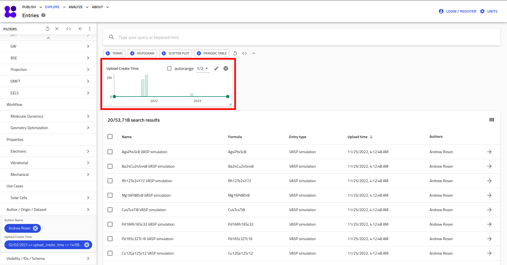
        </label>
    

This is our nascent dashboard.
It will speed up our data exploration tremendously, but first we have to build it out a bit.
**Add to your dashboard**:

- the periodic table ("Elements / Formula" > "Elements")
- "Elements / Formula" > "Number of Elements"
- "Author / Origin / Dataset" > "Dataset Name"

<!-- And **remove from the dashboard**:

- "Electronic" > "Electronic Properties" - not necessary, since there are only DOS
@ndaelman-hu I didn't understand this, you had it striked out so I thought you wanted to remove it, but I guess you were just saying it was not necessary to add?? -->

Feel free to incorporate other filters as well.
Just try to keep everything in a single view.
The more you have to scroll to access the entire dashboard, the more it loses its advantages.
Overall, a **dashboard** should just provide a **quick summary**, for more specific filters there are always the side menu and search bar.

??? tip
    You have lots of control over the layout of your dashboard.
    You can shuffle around _widgets_ by **click & hold their name and then dragging them around**.
    Expanding their size is done by dragging the bottom-right corner (`∟`).
    Widgets start out at their minimal default.
    For a great example of a rich dashboard, visit the [app under "Explore" > "Solar Cells"](https://nomad-lab.eu/prod/v1/staging/gui/search/solarcells).

??? success
    Your dashboard should now look somewhat as in the reference figure.
    Note that you might have play around with the layout to get a perfect match.
    Check the tip box above for more details.

    

        <label>
            <input type="checkbox">
            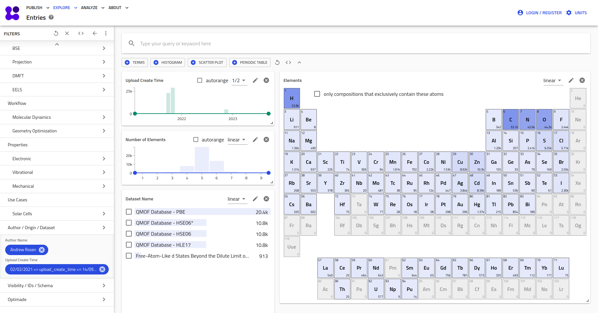
        </label>
    

Now we can get a quick understanding of what data was uploaded.
We are going to **re-apply some settings from scenario 2**.
Restrain the **"Number of Elements"** to 5 and 6, and make sure the **elements H, C, N, and O** are included.
As "Upload Create Time" updates, only 2 upload times are present now.
**Switch between selecting one of each upload times.**
How does the constitution of the data set change?
Pay close attention to all the widgets.

??? success
    Overall, it seems that the **materials covered are quite similar** in both.
    This is not just limited to the composition, but also the crystal makeup.
    You can verify this yourself by checking the "Structure" side pane over at the [final query url](https://nomad-lab.eu/prod/v1/staging/gui/search/entries?n_elements[gte]=5&n_elements[lte]=6&name=Andrew%20Rosen&upload_create_time[gte]=1631565041061&upload_create_time[lte]=1636259701971&elements=H&elements=C&elements=N&elements=O).
    The uploads were instead to different datasets, which seem to differ in methodology: GGA vs hybrid and meta-GGA.

    

        

            <label>
                <input type="checkbox">
                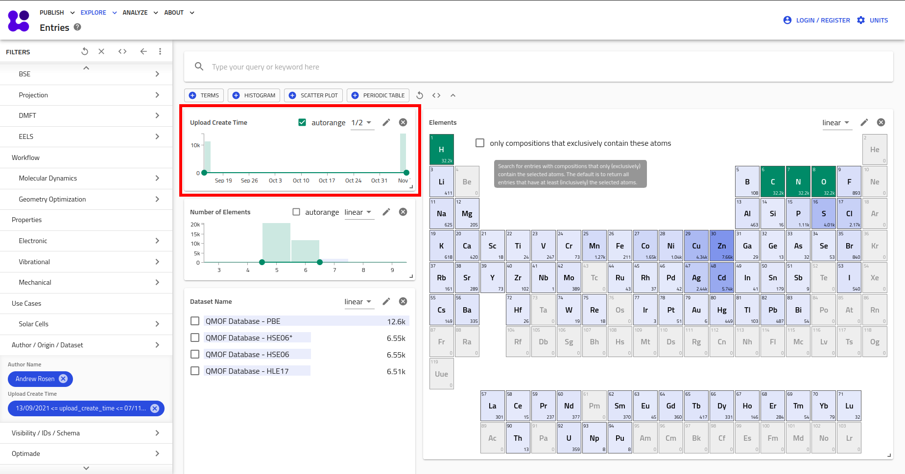
            </label>
        

        

            <label>
                <input type="checkbox">
                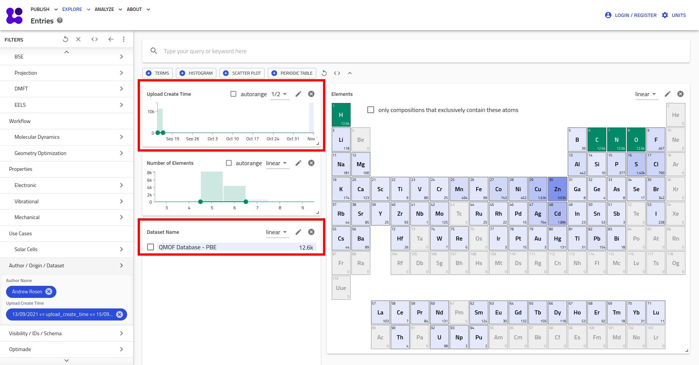
            </label>
        

        

            <label>
                <input type="checkbox">
                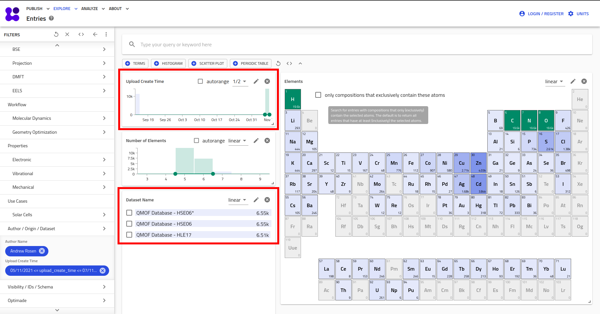
            </label>
        

    

We should have enough information now to retrieve the paper.
While it is nice to have data from a variety of methods, especially for comparison reasons, we are most interested in the HSE06.
There seem to be 2 data sets with that tag and we are not sure what the asterisk (`*`) means.
**Select both HSE06 datasets** then.
**Click on the top entry** in the list.
It will fold out, revealing a summary.
Find the "references" key.
Right-button click the **DOI hyperlink** and open the article in a new tab.

!!! warning "Kinds of DOIs"
    In the example above, we see NOMAD linking **external DOI**s for cross-platform browsing.
    The same happens with datasets hosted over multiple databases: NOMAD will store the other **database's identifier under an "external id"**.

    Conversely, NOMAD is allowed to issue its own DOIs.
    Each **published dataset** receives its **own DOI in NOMAD**, so it can be cited.
    You can search for these under "Author / Origin / Dataset" > "Dataset DOI".
    Other IDs can be found under "Visibility / IDs / Schema".

    In summary, it is really important to understand whether a DOI (or any other kind of ID) refers to internal or external sources.
    When **in doubt, just hover** over the filter or quantity name.

??? success
    You should now have [Machine learning the quantum-chemical properties of metal–organic frameworks for accelerated materials discovery](https://www.cell.com/matter/fulltext/S2590-2385(21)00070-9?_returnURL=https%3A%2F%2Flinkinghub.elsevier.com%2Fretrieve%2Fpii%2FS2590238521000709%3Fshowall%3Dtrue) in front of you.
    Indeed, next time you bump into your colleague, they will be surprised to learn that you already found it.
    Actually, any out of the 4 datasets would have brought you to the same paper as well.
    They are indeed part of the same publication.
    You can verify this yourself.

Reading the **paper and the NOMAD dataset side-by-side**, can help you get the full context much faster.
For example, the abstract mentions that _14.000 experimental MOFs_ were covered.
This is about the size of the PBE dataset (12.600) or both HSE06 sets combined (6.550 each).
The discrepancy could be explained away as a rounding error in the text, missing data, or maybe that not each MOF corresponds one-to-one to single calculation.
The latter could be case for more complex, composed MOFs.
If so, there should be mention of that in the paper.

The datasets also show the _work process_ of the authors.
They first used a very standard method to sample the materials space.
However, GGA is prone to _overbinding_.
Especially in organic systems, the default for a while now has been _hybrids_, e.g. B3LYP, M066, etc.
These are much more expensive in solid state, but still, they ran HSE06 (also a hybrid) over seemingly the entire set.
They also experimented with _meta-GGAs_ in about half the cases.
The reason therefore can be found in the text.
Apparently there is _cited work (no. 147)_ that shows the effectiveness of HLE17 for _large band gap prediction in complex materials_.

!!! warning "Ignoring hidden complexity"
    While the naming of the datasets matches the density functional labels assigned by NOMAD, there could be other relevant information regarding the modelling.
    A good practice would be check under ["Entry" > "DATA" > "run"](https://nomad-lab.eu/prod/v1/staging/gui/search/entries/entry/id/zxxFhlU1kL7SMJuygceeubfXJMGb/data/run/0) to find data that has no associated filter, or
    take a look at the raw input under ["Entry" > "FILES"](https://nomad-lab.eu/prod/v1/staging/gui/search/entries/entry/id/zxxFhlU1kL7SMJuygceeubfXJMGb/files/_mainfile) in case the metadata was not extracted.

    In this case, the [INCAR](https://nomad-lab.eu/prod/v1/staging/gui/search/entries/entry/id/zxxFhlU1kL7SMJuygceeubfXJMGb/files/INCAR/preview) contains **Van der Waals terms** (D3 according to the text) as well.
    This is perfectly normal practice when modeling hydrocarbon chains, but was **not picked up on by NOMAD**.
    Support will be added in the future.

    Meanwhile, the dataset name probably does not reflect these settings, as D3(BJ) is used in all of them.
    Remember, a **dataset name is only as accurate as the author wants** it to be.

<!-- Then there is _the matter of HSE06 and HSE06*_. -->

As a **last reflection**, note how many of the entries and statistics match our findings in scenario 2.
Indeed, Andrew Rosen made a big contribution to our coverage of MOFs.
Such **contributions from the community** are what drive NOMAD.
You may consider contributing your data already during the research/analysis process, right before submitting a publication, or even later on (especially for data that you have from older publications!).

Andrew first even published his data over at [figshare](https://figshare.com/articles/dataset/QMOF_Database/13147324) and shortly after uploaded it to NOMAD.
It is good that he did, since NOMAD provides much more information (the full calculation) and covers a wide search range.
Meanwhile, over at _figshare_, you have to download a zip folder, not knowing what to exactly expect.
Andrew clearly put some effort in providing a structured overview, focusing heavily on the MOF description and little else.
For the end-user **having data available over multiple repositories thus works synergistically**, as each platform allows for a different emphasis.
