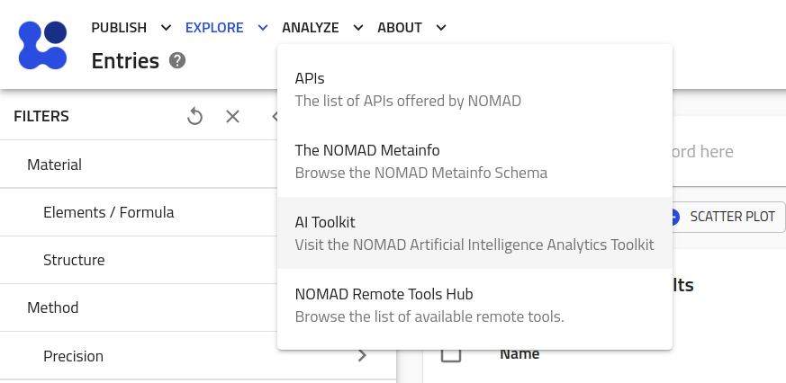

# Part I: Overview of the NOMAD Archive and Repository.

We start the tutorial with a brief overview of the NOMAD Archive and Repository (in short, NOMAD-lab) A more general tutorial can be found in the [FAIRmat tutorial 1](https://www.fairmat-nfdi.eu/events/fairmat-tutorial-1/tutorial-1-home).


## Exploring NOMAD {#entries_section}

Go to the [NOMAD-lab website](https://nomad-lab.eu/nomad-lab/).

There are 2 main versions when exploring NOMAD-lab: 1. the [stable version](https://nomad-lab.eu/prod/v1/gui/search/entries) ("Open NOMAD" button at the top-right corner of the page), and 2. the [Beta version](https://nomad-lab.eu/prod/v1/staging/gui/search/entries) ("Beta/staging" link at the bottom-right of the page, or via "Solutions > NOMAD" in the top menu and then scrolling down).

<p align="center">
    
     NOMAD.">
</p>

We recommend using the Beta version, since the NOMAD infrastructure is constantly being updated.

The landing NOMAD Entries page is a very intuitive and easy-to-use Graphical User Interface (GUI). Here you can explore data according to your preferences by clicking on the filter menus on the left. You can then select a variety of quantities that characterize the Material or system under study, the methodology parameters followed in the calculation or experiment, and the output properties.

<div class="click-zoom">
    <label>
        <input type="checkbox">
        
    </label>
</div>
<div class="click-zoom">
    <label>
        <input type="checkbox">
        
    </label>
</div>

<!-- There is a large variety of options to filter data in NOMAD. In this tutorial, you will learn about data for electronic-structure calculations, i.e., data obtained when solving Density Functional Theory (`DFT`), `GW` approximation, Bethe-Salpeter equation (`BSE`), projected tight-binding models (`Projection`), and Dynamical Mean-Field Theory (`DMFT`), as well as in the Properties menu called "Electronic". All of these menus contain (meta)information important for these calculations. If you feel some important quantity is missing, or maybe you want to extend to other electronic-structure techniques, please contact us! -->

### <u> **Exercises** </u>

Try filtering the entries according to the following instructions:

1. Find all entries related to water, via a search by chemical formula ("Material > Elements/Formula > Chemical Formula"). How many entries do you find?
    a. Add a histogram of the `upload_create_time` using the widget buttons directly under the search bar. **TODO - this is not the best demonstration cause these were all added in the same time frame.**

2. Use the search bar to filter by `program_name`. (The proper quantity is `results.method.simulation.program_name`, but this should be suggested to you as soon as you start to type `program` into the search bar).
    a. How many entries from GROMACS and LAMMPS are there?
    b. How many of these entries are related to a molecular dynamics workflow?

3. (CHALLENGE) Find any datasets of molecular dynamics simulations.
    a. **TODO - I wish we could make an interesting scatter plot here**


## The NOMAD Metainfo

NOMAD stores all processed data in a well defined, structured, and machine readable format, known as the `archive`.
The schema that defines the organization of (meta)data within the archive is known as the `MetaInfo`.
More information can be found in the NOMAD docs: [An Introduction to Schemas and Structured Data in NOMAD](https://nomad-lab.eu/prod/v1/docs/schema/introduction.html).

Go to "Analyze > The NOMAD Metainfo" in the top-left menu of NOMAD, where you can navigate through or search the entire set of NOMAD Metainfo definitions.

<div class="click-zoom">
    <label>
        <input type="checkbox">
        
    </label>
</div>

The NOMAD Metainfo covers a very wide range of materials data beyond computational data, including electronic lab notebooks and a variety of experimental techniques.
The most important archive sections for computational data is illustrated in the following diagram:

```
archive
├── run
│    ├── method
│    │      ├── atom_parameters
│    │      ├── dft
│    │      ├── forcefield
│    │      └── ...
│    ├── system
│    │      ├── atoms
│    │      │     ├── positions
│    │      │     ├── lattice_vectors
│    │      │     └── ...
│    │      └── ...
│    └── calculation
│           ├── energy
│           ├── forces
│           └── ...
└── workflow2
     ├── method
     ├── inputs
     ├── tasks
     ├── outputs
     └── results
```

Search through the NOMAD Metainfo sections displayed above to get an idea of what kinds of quantities are stored in each section. In [Part II](part2.md), you will learn how to explore the actual populated quantities of the Metainfo for specific entries.

**TODO - Should we add a few exercises here? Or is it not necessary?**

## The NOMAD API
Another important functionality in NOMAD is being able to perform queries and analyze the resulting downloaded data from it. Once you have decided searching for a set of materials with certain properties and derived from your prefered methodology, NOMAD gives you another tool to perform a query via Application Programming Interface (API) queries or calls. This can be found by clicking the symbol `<>` at the top of the filter menus.
<!-- In [Part II](part2.md), you will learn how to use an API query to get GW data and work with it in a Jupyter Notebook for analysis and plotting of the DFT and GW band structure. -->

<div class="click-zoom">
    <label>
        <input type="checkbox">
        
    </label>
</div>

**TODO - Does this fit here??**

## The AI Toolkit

The [Artificial-Intelligence Toolkit](https://nomad-lab.eu/aitoolkit) is a collection of tools and tutorials for applying artificial-intelligence approaches (including machine-learning, compressed sensing, and data mining) to the materials data found on the NOMAD repository.

Currently, the AI-toolkit focuses on analysis of *Ab Initio* data. This focus will be broadened as a larger amount of MD data is added to NOMAD. In the mean time, the toolkit still provides a nice platform for learning about state-of-the-art data analysis techniques in the context of materials data.

You can reach the toolkit by going to "Analyze > AI Toolkit" in the top-left menu on the NOMAD page  You can navigate to the AI toolkit. The specifics of the toolkit is beyond the scope of this tutorial. However, we encourage you to explore its features on your own.

<div class="click-zoom">
    <label>
        <input type="checkbox">
        
    </label>
</div>

<div class="click-zoom">
    <label>
        <input type="checkbox">
        
    </label>
</div>