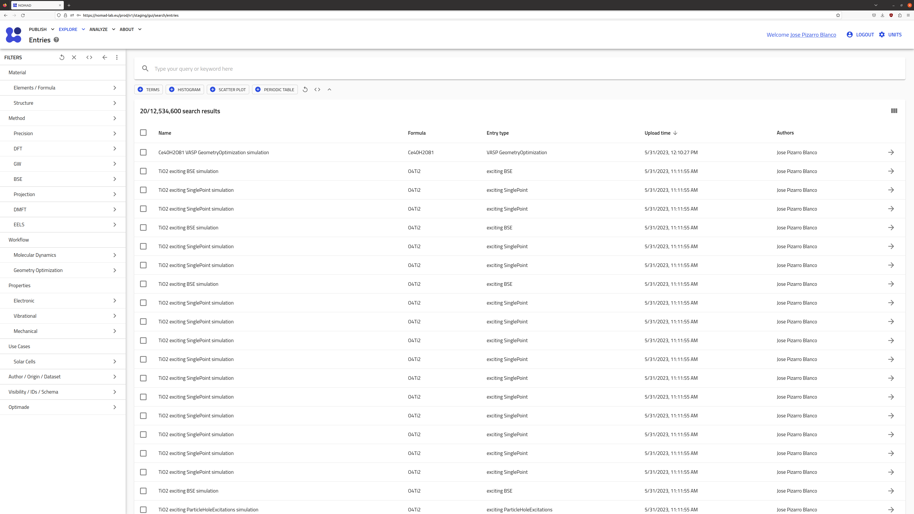

# Part I: Overview of the NOMAD Archive and Repository.

We start the tutorial with a brief overview of the NOMAD Archive and Repository (in short, NOMAD-lab) A more general tutorial can be found in the [FAIRmat tutorial 1](https://www.fairmat-nfdi.eu/events/fairmat-tutorial-1/tutorial-1-home).

## Exploring NOMAD {#entries_section}

Go to the [NOMAD-lab website](https://nomad-lab.eu/nomad-lab/).

There are 2 main versions when exploring NOMAD-lab: 1. the [stable version](https://nomad-lab.eu/prod/v1/gui/search/entries) ("Open NOMAD" button at the top-right corner of the page), and 2. the [Beta version](https://nomad-lab.eu/prod/v1/staging/gui/search/entries) (`Beta/staging` link at the bottom-right of the page, or via `Solutions > NOMAD` in the top menu and then scrolling down).

    
     NOMAD.">

We recommend using the Beta version, since the NOMAD infrastructure is constantly being updated.

The landing NOMAD Entries page is a very intuitive and easy-to-use Graphical User Interface (GUI). Here you can explore data according to your preferences by clicking on the filter menus on the left. You can then select a variety of quantities that characterize the Material or system under study, the methodology parameters followed in the calculation or experiment, and the output properties.

    <label>
        <input type="checkbox">
        
    </label>

    <label>
        <input type="checkbox">
        
    </label>

<!-- There is a large variety of options to filter data in NOMAD. In this tutorial, you will learn about data for electronic-structure calculations, i.e., data obtained when solving Density Functional Theory (`DFT`), `GW` approximation, Bethe-Salpeter equation (`BSE`), projected tight-binding models (`Projection`), and Dynamical Mean-Field Theory (`DMFT`), as well as in the Properties menu called "Electronic". All of these menus contain (meta)information important for these calculations. If you feel some important quantity is missing, or maybe you want to extend to other electronic-structure techniques, please contact us! -->

## <u> **Exercises** </u>

Try filtering the entries according to the following instructions:

1. Find all entries related to water, via a search by chemical formula ("Material > Elements/Formula > Chemical Formula"). How many entries do you find?
    a. Add a histogram of the `upload_create_time` using the widget buttons directly under the search bar. **TODO - this is not the best demonstration cause these were all added in the same time frame.**

2. Use the search bar to filter by `program_name`. (The proper quantity is `results.method.simulation.program_name`, but this should be suggested to you as soon as you start to type `program` into the search bar).
    a. How many entries from GROMACS and LAMMPS are there?
    b. How many of these entries are related to a molecular dynamics workflow?

3. (CHALLENGE) Find any datasets of molecular dynamics simulations.
    a. **TODO - I wish we could make an interesting scatter plot here**

Let's jump into the [NOMAD page](https://nomad-lab.eu/prod/v1/staging/gui/search/entries?upload_create_time[gte]=1419895487748&upload_create_time[lte]=1694679900000).
Take a look at the layout.
Some elements immediately stand out:

- In the middle, there is a whole list with tabulated data.
- Just above it is a search bar with the text "Type your query or keyword here".
- On the left-hand side is a _filters menu_.
- At the very top is a header with several options (left-hand side), login and units (right-hand).
Apparently, the page we have in front of us is called _Entries_.

Now, let's run through some _scenarios_ that you, as a researcher, might encounter.

### Scenario 1 - Example setup

!!! assignment
    **You want to learn how to set up a Molecular Dynamics simulation in _Gromacs_ and need an example.
    Your system of interest is _water_, which can be quite tricky to model.
    You want to compare results from several setups to find the one most suitable to you.**

    In this exercise, you will learn how to:

    - toggle and combine filters.
    - work with dynamic statistics.
    - reset the search.

In the _entries table_ NOMAD is already listing all database _entries_.
The strategy is to **narrow or _filter_ this list down** to our needs.
Our main tool here, will be the _search menu_ (left-hand side).
Take stock of its structure.
There is a list of _filter groups_ or themes.
Subgroups are indented below their main group.
Any filter group with an arrow (`>`) can be clicked open to reveal various filters and statistics.
To close the side pane and reveal the full table again, use the arrow back (`<-`) or simply click anywhere outside of it.

Now, **scroll down to check out the full list**. What main groups are there?
Remember, we essentially want to learn more about Gromacs and its calculation setup.
**Under which filter groups do you think we could find them?**

While it is somewhat hidden, you can find the "Program Name" under "Method".
It comes with a text bar and a list of suggestions.
You can try extending the list further and further, but Gromacs is not the most represented code in our database.
Here, it is probably faster to just type out its name.
Take a look back at the **side menu**, where you will find the **applied filter listed as _chips_**.

!!! tip
    Almost all text bars in NOMAD support **autocomplete**.
    This comes in handy when you are unsure of the spelling or capitalization.
    Start with the first few letters and select your choice by clicking or hitting `<enter>`.

Notice how the overview list changes with respect to your filter!
Yet, the list of remaining calculations is still quite long (3.496 matches)... 
Most likely, there will not be a single filter that solves our problem completely.
That is alright, though, we can just **stack up several filters**.

!!! tip
    You can toggle the **statistics** scale via the dropdown menu right to the name.
    Conversely, if the statistics are ever the browser down, deactivate them by deselecting "Filters" > "options menu" (`⋮`) > "Show advanced statistics".

Which subsequent filter to search for first depends on your priorities: do you want to learn mostly about running Molecular Dynamics or how a forcefield for water should be tweaked?
Let us go with former.
Fortunately, there already is a **filter subgroup called "Molecular Dynamics", so click it open**.
You are now presented with several settings.
Judging from the statistics, we have the best chance with a setting that covers the widest range of calculations (28.000 entries).
**Select "Temperature" under "Available Properties"**. <!-- @Joseph: do you want me to to add a "Molecular Dynamics" selection button?-->

!!! tip
    If you have trouble **understanding any term**, just hover over it with the mouse.
    A summary text will appear.
    For example, "Molecular Dynamics" > "Available Properties" clarifies that we are dealing observables documented along the trajectory.

System specifications are found under "Material".
Since we know the composition of our system, **click on "Elements / Formula"** and **select the matching elements** in the periodic table.
The number of database entries containing the other elements too is communicated via the color code.
Those that are already **filtered out will be gray**, just as you saw when opening the side pane.
This is the filter stacking mentioned before, showing that Gromacs users typically work on organic systems.
You can see both chips on the left.
Note how there is an "and" in between.
While **filters** between side menu options stack, those **within a side pane each have their own logic**.
We are looking for pure water, so O and H suffice. <!-- Shame how we don't have a subgroup search yet -->
**Remove all data with additional elements** by selecting "only compositions that exclusively contain these atoms".

!!! success
    You are left with 2 MD calculations in the entries list.
    Clicking on either, will fold out a quick summary.
    **Clicking on the arrow** (`->`) will bring you to an _Overview page_.
    More on that in [Part II](part2.md).
    By **clicking through on "FILES"**, you will get an overview of the uploaded files.
    These for sure contain output, but often also input.
    Both could serve as great starting points for deploying your own calculations.

Actually, the **exact historical order** in which we applied the filters **does not matter**.
I.e. the same set of filters will yield the same search result.
This insight comes with a small caveat: the statistics that we see as we are stacking up our filters will behave differently.
These filters are like small questions or details that we use construct an overall query.
If we take a **different route**, we will see **different intermediate results** and this could lead us to **change our final formulation**.

To see this effect in action, rewind back to where we were choosing our priorities and let us go with the latter instead.
Just **click the cross (`x`) at the top of the filter menu**, and **reapply the filters** for Gromacs and the composition.
Just with these settings, the entries list is so short, that we could **check the specific calculations** even **by hand**!

!!! success
    Glossing over the remaining 6 results, you discover that Sebastian Baugmart has 2 other MD simulations which were not classified as such. <!-- @Joseph is this a bug? -->
    We also find 2 more Geometry Optimizations of both systems.
    While these do not exactly match our initial objective, they could still provide us with valuable insights.
    They also inform us of the overarching workflow used by both authors, i.e. first relax the system, then run MD under various constraints. <!-- @Joseph: thermostats? -->

### Scenario 2 - Data science

!!! assignment
    **You want to evaluate the impact of the metal used in _Metal Organic Frameworks_ (MOFs).
    Maybe, if you find enough high-quality data, you can even train a machine-learned model.
    Specifically, you are interested in predicting the band gap [^1].**

    [^1]: The band gap is the solid state counterpart of the HOMO-LUMO energy gap. Given that NOMAD is materials-centric (while still allowing molecular systems), it deals in condensed matter nomenclature. <!-- @Joseph: I could change the terminology here to "Band gap / HOMO - LUMO". That would make it more accessible to other communities as well. -->

    In this exercise, you will learn how to:

    - customize the entries table.
    - use the search bar.
    - the "OR" filter stacking.

In this scenario our objective is more vaguely defined, so we will **start by exploring** the database before focusing in.
A good overview is fundamental for spotting interesting data.
As you will have noticed, our main tool here is the **entries list** (supplemented by the statistics).
Unfortunately, the default columns (Entry "Name", the Hill "Formula", "Entry type", "Upload time", and "Authors") are not that helpful when exploring the _materials space_.
To **choose new columns**, **click on the three vertical slots** on the upper-right corner, opposite to "search results".
You will be presented by a selection box menu of various quantities.
**Deselect**

- "Name": it contains similar information as both "Formula" and "Entry Type",
- "Upload time": we do not care for now about when the data was uploaded,
- "Author": dito,

and instead **select**

- "Dimensionality": to distinguish whether we are dealing with bulk, surface, or molecules.
- "Crystal system": the symmetry of the supercell.
- "Space group symbol": the symmetry of the atomic coordinates inside the supercell.
- "Comments": just to give us a bit more context, if needed.

The 3 first selections can all be found under "Material" > "Structure".
Let us furthermore **sort alphabetically by (Hill) "Formula"**.
The column that is being used for sorting has an arrow next to its name.
The direction of this arrow decides the ordering: ascending / alphabetical (up) or descending / reverse alphabetical (down).
**Click on column header** to use it for sorting.
The default ordering will be up.
By clicking the same column header again, you can toggle it.

!!! tip
    **What are entries exactly?**
    Entries are individually stored data packages, shown as a row in the overview table.
    In our context, they most overlap with an _individual calculation_, be they single-point or with updates to the atomic coordinates.
    When separate calculations are linked together into a _workflow_ (see [Part II](part2.md)), the overall link also receives its own dedicated entry.
    Lastly, since NOMAD covers the whole of condensed matter, entries can also be _experimental samples_ or _batches_.

!!! success
    You should now have a view in front of you similar to the reference figure.
    There is **little room for deviation**, since the **horizontal column order** is predetermined (matching the one in the selection box menu).
    Similarly, there can only be **one column for sorting** at a time.

...

To real use a **dataset** for machine-learning, it should be **homogeneous** across its entire setup, safe for the variables that we are interested in.
Most of the data on NOMAD is _Density Functional Theory_ (DFT), with some GW and classical forcefields.
GW would overall be better for high-quality band gaps, but DFT will end up being more useful due to its sheer number of entries.
Just as with forcefields, DFT is mostly determined by the choice of kernel, i.e. density functional.

Hybrid functionals are the norm for organic systems and the most popular in solid state by far are HSE06 and HSE03.
By now, you probably have a good instinct of where to find them in the side menu (under "DFT").
But opening and closing the side panes while keeping an eye on the entries list is quite the hassle.
As you get more familiarized with the range of filters, there is a faster alternative.
**Click into the search bar** (above the entries list) to start typing.
You can start out by writing the filter name, but you can just as well skip to the value.
This second option works great when a value fully determines the filter type.
**Start typing "HSE"** and select (click + enter) both **"HYB_GGA_XC_HSE03" and "HYB_GGA_XC_HSE06"** (2x), both very prominent hybrids in solid state.
What is the filter's full name?
Also tack stock of how an _equality query_ is structured.

Hold on.
How can an entry contain 2 exchange-correlation functionals at once?
Are we maybe filtering for workflows that contain both?
For your answer, take a look at the side menu.

!!! success
    You will find the same chips as usual under "DFT".
    Only now, "HYB_GGA_XC_HSE03" and "HYB_GGA_XC_HSE06" are separated by the **connector "OR"** rather than "AND".
    Just as the name suggests, the logic condition is different in this case.
    Our "XC Functional Names" filter as not been narrowed down, but **extend to search for both** options.

    Moreover, note how the **filter name** is contained in the **last term** of the autocompleted version ("results.method.simulation.dft.xc_functional_names").
    The **equality query** is defined using a **single equals sign (`=`)**, not double (`==`) or triple (`===`) as in some programming language. 

!!! tip
    The exchange functional naming in NOMAD follows the **convention established by [libxc](https://github.com/ElectronicStructureLibrary/libxc)**, a popular library for evaluating (semi)local functionals.
    In practice, this goes as `<hybrid flag>_<Jacob's Ladder>_<exchange-correlation part>_<name identifier>`, where **`<name identifier>` is the main ID** and the other tags simply provide metadata.
    `<hybrid flag>` is only present when the functional truly is a hybrid.
    
    Where sensible, the libxc **_exchange-correlation_ functionals (`XC`) are split up** into _exchange_ (`X`) and _correlation_ (`C`), providing the user with the option of mixing as they see fit.
    So it definitely is possible for a **single entry** (and even calculation) to be assigned **multiple functional names**, just not `XC`!
    For example, the most represented functional in NOMAD, `PBE`, is stored as `[GGA_X_PBE, GGA_C_PBE]`.
    Note that selecting one of either or even both (due to the `OR` logic), does not guarantee a user will retrieve only PBE.

With the main method specified, there are still a bunch of additional numerical settings that may affect the fidelity of the results, such as the _basis set_.
These can all be found under the filter subgroup "Precision".
It is tough to estimate these parameters' actual impact.
Therefore, they are best left till the end of the full query.
Then you can evaluate the cost-benefit of reducing the dataset you retrieve for homogeneity or precision.

This feature is quite recent.
For it to have any impact, the NOMAD database has to run over all of 13 million entries and reprocess them.
In other words, new features will always lag behind in old data.
Please bear this in mind.
Since there are too few examples at the moment, we will skip this set of filters.
If you are interested, though, feel free to check out the FAIRmat [Tutorial 10](https://www.fairmat-nfdi.eu/events/fairmat-tutorial-10/tutorial-10-home) for a full rundown.

Lastly, we only want data that contains the relevant observable, the band gap.
The search bar currently does not support _presence queries_, so we fall back onto the side menu.
Observables that come out of a calculation, workflow, etc. are called _"Properties"_.
You may have noticed this filter group on your first scroll through.
There are several categories of properties.
Which do you think?
Could the search bar be of use in finding the right category?

!!! tip
    Terms in the search bar never contain spaces (` `), but use underscores (`_`) instead .

!!! success
    The band gap describes the electronic structure around the Fermi energy.
    Hence, the **"Electronic" filter subgroup** best matches that theme.
    The search bar can even tell you the full classification, as it autocompletes "band_gap" to "results.properties.electronic.band_structure_electronic.band_gap.type/value".
    Note the sequence "properties.electronic".

The way this side pane is layed out, it first gives you an _overview_ of what is out there and below hands you _filters for narrowing_ the properties further down.
When filtering by presence, the overview suffices.
How would you finish the query?

!!! success
    The number of entries with an extracted band gap is too low (just 11 entries).
    This is far too little for machine-learning, let alone any statistical analysis.
    Instead, we can go with **"Density of states"** (DOS) [^2], matching 6.5200 entries.
    There is no need to narrow it down, we accept both data from spin-polarized and spin-restricted calculations.

    You can download the DOS, but will still have to extract the band gap yourself.
    This is mostly a scripting question, since almost all DOS will contain the necessary information.
    NOMAD's past extraction of the band gap was quite limited.
    This has been mended and is being applied over the whole database.

With that we have our final query, for now.
The best strategy would be to at this point download the data you need and start applying some statistical analysis first.
You might come across some new ideas how to further hone your query and filter out all irrelevant noise.

So, **click the checkbox next to the column headers** in the entries list to select all entries.
The 3 vertical slots now change to a **download symbol**, given you the option between the original (raw) format or the **NOMAD format** (processed).
To save your query for future use, **click on the _code symbol_** (`< >`) to the right of "FILTERS" in the **side menu**.
The specifications are found in the **"Request" section**.
You can **copy them** over to a local file using the _clipboard symbol_.

### Scenario 3 - Finding Publications

!!! assignment
    **You are talking to a colleague about your machine-learned model (from scenario 2).
    They tell you there was a good recent publication of Rosen, but are forgetting the rest of the details at the moment.
    They will get back to you, but you are eager to check it out right away.**

    In this exercise, you will learn how to:

    - filter by publication metadata.
    - set up a dashboard.
    - examine an entry summary.

The obvious starting point would be use a search engine specialized in publications, such as [**Google Scholar**](https://scholar.google.com/).
Just searching by the author's (last?) name, yields a suggestion for "Robert A. Rose", who seems to be working in biomedicine.
Not quite what we were looking for...
You can **try adding some more terms** describing the field, e.g. _ab initio_, DFT or MOFs.

!!! success
    This way it is possible to find the author's full name (**Andrew S. Rosen**) and also his publication history.
    Here we have hit a dead-end in as far as Google Scholar can help.
    Now it would be a matter of going over the publication list manually.

Let us see how to leverage NOMAD for this research case.
At the bottom of the side menu there are several filter groups covering the **publication metadata under "Author / Origin / Dataset"**.
The first filter in the side pane is a **search by "Author Name"**.
**Type in "Rosen"**.
We get 2 suggestions, but only one matches perfectly.
**Select "Andrew Rosen".**
Actually, if you performed the Google Scholar search _successfully_, you should have found the same author.

Take stock of the **"Upload Create Time"** statistiscs right below "Author Name".
It appears that Rosen has uploaded 3 times to NOMAD, each time in quite large batches ranging from to thousands to tens of thousands of entries.
That is some very rich data.
To better understand its make up, we have to compare several statistics at once.
Jumping between side panes is a bit of a hassle, so instead we will speed up our analysis by setting up a _dashboard_.
**Click on the plus button (`+`) at the utmost right from "Upload Create Time"** and **return to the entries list**.

!!! success
    You should now find the same statistic nestled between the search bar and the entries list.

This is our nascent dashboard.
It becomes most useful for fast comparison and selection, but first we have to build it out a bit.
**Add to your dashboard** at least:

- the periodic table ("Elements / Formula" > "Elements")
- "Elements / Formula" > "Number of Elements"
- "Author / Origin / Dataset" > "Dataset Name"
- ~~"Electronic" > "Electronic Properties"~~ is not necessary, since there are only DOS

Feel free to incorporate other filters as well.
Just try to keep everything in a single view.
Once you have to scroll to see the entire dashboard, it starts losing its speed advantage.
Overall, a dashboard should just provide a quick summary, for more specific filters there are always the side menu and search bar.

!!! tip
    You have a lot of control over the layout of your dashboard.
    You can shuffle around _widgets_ by **click & hold their name and then dragging them around**.
    Expanding their size is done by dragging the bottom-right corner (`∟`).
    Widgets start out at their minimal default.
    For a great example of a rich dashboard, visit the [app under "Explore" > "Solar Cells"](https://nomad-lab.eu/prod/v1/staging/gui/search/solarcells).

!!! success
    Your dashboard should now look somewhat as in the reference figure.
    Note that you might have play around with the layout to get a perfect match.
    Check the tip box above for more details.

<!-- Also personalize the entries list? -->

Now we can get a quick understanding of what data was uploaded.
We are going to re-apply some settings from scenario 2.
**Restrain the "Number of Elements" to 5 and 6**, and **make sure the elements H, C, N, and O are included**.
As "Upload Create Time" updates, only 2 upload times are present now.
**Switch between selecting one of each upload times.**
How does the constitution of the data set change?
Pay close attention to all the widgets.

!!! success
    Overall, it seems that the **materials covered are quite similar** in both.
    This is not just limited to the composition, but also the crystal makeup.
    You can verify this yourself by checking the "Structure" side pane.
    The uploads were instead to different datasets, which seem to differ in methodology: GGA vs hybrid and meta-GGA.

We should have enough now to retrieve the paper.
While it is nice to have data from a variety of methods, especially for comparison reasons, we are most interested in the HSE06.
There seem to be 2 data sets under with that tag and we are not sure what the asterisk (`*`) means.
**Select both HSE06 datasets** then.
**Click on the top entry** in the list.
It will fold out, revealing a summary.
Find the "references" key.
Right-button click the DOI hyperlink and **open the article in a new tab**.

!!! warning
    **Kinds of DOIs**

    In the example above, we see NOMAD linking **external DOI**s for cross-platform browsing.
    The same happens with datasets hosted over multiple databases: NOMAD will store the other **database's identifier under "external id"**.

    Conversely, NOMAD is allowed to issue its own DOIs.
    Each **published dataset **receives its **own DOI in NOMAD**, so it can be cited.
    You can search for these under "Author / Origin / Dataset" > "Dataset DOI".
    Other IDs can be found under "Visibility / IDs / Schema".

    In summary, it is really important to understand whether a DOI (or other kind of ID) refers to internal or external sources.
    When **in doubt, just hover** over the filter or quantity name.

!!! success
    You should now have [Machine learning the quantum-chemical properties of metal–organic frameworks for accelerated materials discovery](https://www.cell.com/matter/fulltext/S2590-2385(21)00070-9?_returnURL=https%3A%2F%2Flinkinghub.elsevier.com%2Fretrieve%2Fpii%2FS2590238521000709%3Fshowall%3Dtrue) in front of you.
    Indeed, next time you bump into your colleague, they will be surprised to learn that you already found it.
    Actually, any other dataset would have brought you to the same paper.
    They are indeed part of the same publication.
    You can verify this yourself.

Reading the **paper and the NOMAD dataset side-by-side**, can help you get the full context much faster.
For example, the abstract mentions that _14.000 experimental MOFs_ were covered.
This is about the size of the PBE dataset (12.600) or both HSE06 sets combined (6.550 each).
The discrepancy could be explained away as a rounding error in the text,  missing data, or maybe that not each MOF corresponds one-to-one to single calculation.
The latter could be case for more complex, composed MOFs.
If so, there should be mention of that in the paper.

The dataset also show the _work process_ of the authors.
They first used a very standard method to sample the materials space.
However, GGA is prone to yield _overbinding_.
Especially in organic systems, the default for a while now has been the more _expensive hybrids_, e.g. B3LYP, M066, etc.
These are much more expensive in solid state, but still, they ran HSE06 over seemingly the entire set.
They also experimented with _metaGGAs_ in about half the cases.
The reason therefore can be found in the text.
Apparently there is _cited work (no. 147)_ that shows the effectiveness of HLE17 for _large band gap prediction in complex materials_.

!!! warning
    **Ignoring hidden complexity**

    While the naming of the datasets matches the density functional labels assigned by NOMAD, there could be other relevant information regarding the modelling.
    A good practice would be check under ["Entry" > "DATA" > "run"](https://nomad-lab.eu/prod/v1/staging/gui/search/entries/entry/id/zxxFhlU1kL7SMJuygceeubfXJMGb/data/run/0) to find data that has no associated filter, or
    take a look at the raw input under ["Entry" > "FILES"](https://nomad-lab.eu/prod/v1/staging/gui/search/entries/entry/id/zxxFhlU1kL7SMJuygceeubfXJMGb/files/_mainfile) in case the metadata was not extracted.

    In this case, the [INCAR](https://nomad-lab.eu/prod/v1/staging/gui/search/entries/entry/id/zxxFhlU1kL7SMJuygceeubfXJMGb/files/INCAR/preview) contains **Van der Waals terms** (D3 according to the text) as well.
    This is perfectly normal practice when modeling hydrocarbon chains, but was **not picked up on by NOMAD**.
    Support will be added in the future.

    Meanwhile, the dataset name probably does not reflect these settings as D3(BJ) is used in all of them.
    Remember, a **dataset name is only as accurate as the author wants** it to be.

<!-- Then there is _the matter of HSE06 and HSE06*_. -->

As a **last reflection**, note how many of the entries and statistics match our findings in scenario 2.
Indeed, Andrew Rosen made a big contribution to our coverage of MOFs.
Such contributions from the community are what make NOMAD great.
One self-explanatory opportunity could be as part of a publication.
Andrew first even published his data over [figshare](https://figshare.com/articles/dataset/QMOF_Database/13147324) and shortly after loaded it up (see [part III](part3.md)) to NOMAD.
It is good that he did, since NOMAD yields much more information (the full calculation) and search functionality at the same height as data from wide variety of other sources.
Meanwhile, over figshare, you have to download a zip folder, not knowing what to expect exactly.
Andrew clearly put some effort in providing a structured overview, although it is heavily focused towards description of the MOF and little else.
In other words, each platform allow for different accents and structures.
**Combining both repositories** leads to the best coverage.

## Glossary
