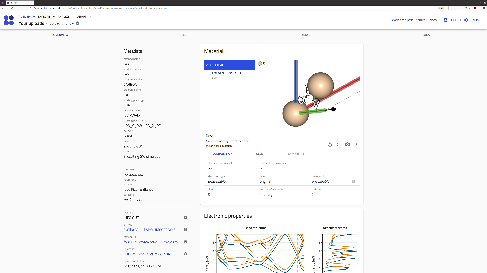
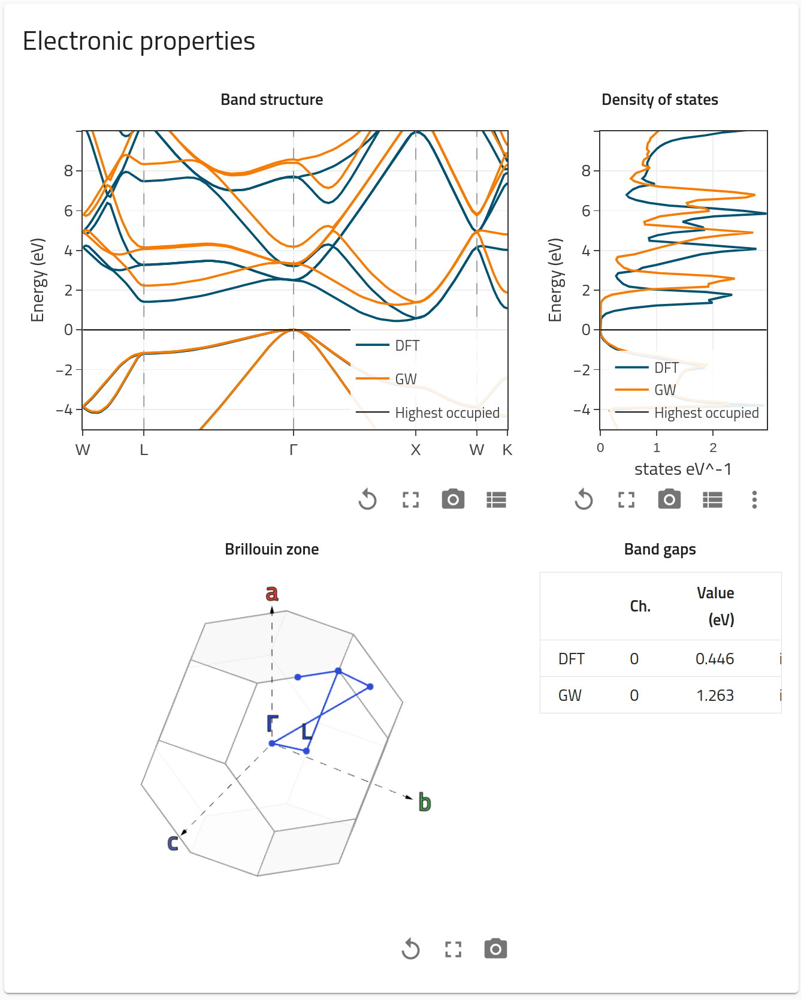
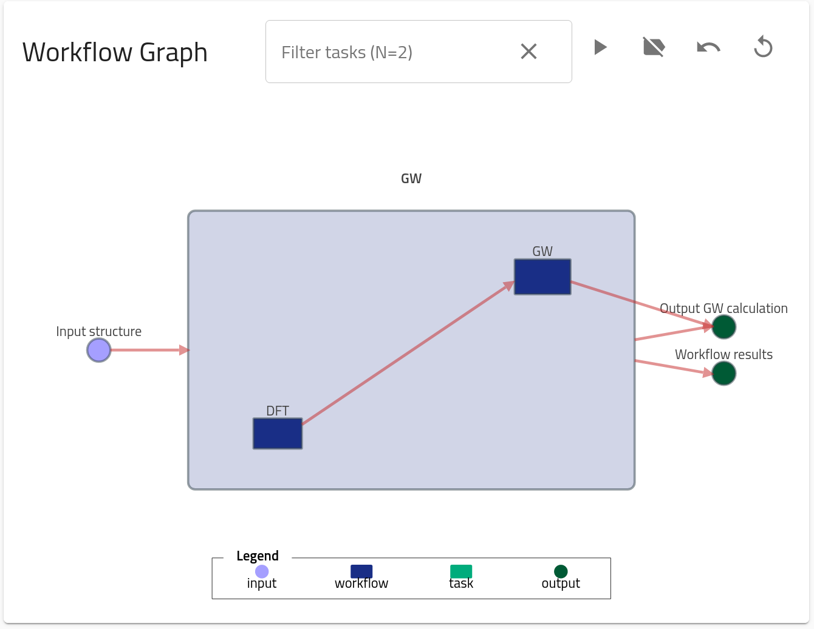
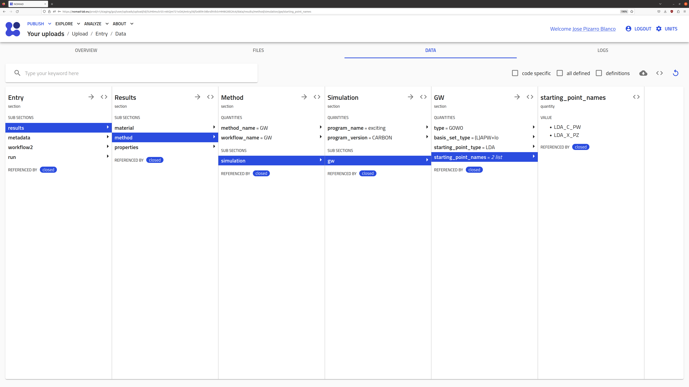

# Part II: How to make an upload and query data in NOMAD.

This part contains the information on how to make an upload with computational data in NOMAD, how to browse through the parsed metadata, and how to use API calls to query data in NOMAD for analysis. We will use an example dataset for a DFT+GW calculation for Si2. Similar to the [Part I](part1.md), a more general tutorial can be found in the [FAIRmat tutorial 1](https://www.fairmat-nfdi.eu/events/fairmat-tutorial-1/tutorial-1-home) and the materials therein.

You can find this example data by searching certain parameters, as shown at the end of [Part I](part1.md). You can download the example data files when browsing to the specific entry. The _upload id_ of the example used in this tutorial is [9FVTPztzTdGNVSEbc4QbXg](https://nomad-lab.eu/prod/v1/staging/gui/search/entries/entry/id/ZmJ0UaVCIedx0EdqCMpPnSuXjorZ/files/).

## Uploading computational data to NOMAD

Go to the [NOMAD Entries page](https://nomad-lab.eu/prod/v1/staging/gui/search/entries), and click on the top-left menu "Publish > Uploads". 

    <label>
        <input type="checkbox">
        
    </label>

You can then click on "Create a new upload" button, or even try one of the examples in "Add example uploads". The page for creating a new upload allows you to upload, edit author metadata, and publish your data with an embargo. The system works by a drag-and-drop files system. For this tutorial, you are going to learn how to upload and explore the metadata of a DFT + GW calculation done by the code [_exciting_](https://exciting-code.org/). 

    <label>
        <input type="checkbox">
        
    </label>

## Browsing entries

As you can see in the GIF, after we drag-and-drop the zipped files a processing starts. NOMAD will try to find the corresponding parsers, and if succesful, new entries are generated. In this example, you are uploading a DFT + GW calculation for which three entries are generated: `DFT SinglePoint`, `GW SinglePoint`, and `GW`. You can later visit the [Part IV](part4.md) to learn more, but for now is enough to know that NOMAD differentiates between the DFT part, the GW part, and then combines both in what is called the `GW workflow` entry. This last one is the one containing the combined meta-information of DFT and GW, and thus, it is the most general entry of all three.GW upload gi

You can browse each entry by clicking on right arrow `→`. You will land in the Overview page of the entry, which contains basic information and visualizations for the entry.

    <label>
        <input type="checkbox">
        
    </label>

Extra visualizations, such as the _Electronic properties_ or the _Workflow graph_ will appear depending on the character of the entry (for example, a Molecular Dynamics calculation will not contain _Electronic properties_ but rather _Thermodynamic properties_ and _Trajectories_ visualizations, see [FAIRmat tutorial 7](https://www.fairmat-nfdi.eu/events/fairmat-tutorial-7/tutorial-7-home)).

    
    

Besides Overview, there are also other menus: "FILES", a list of all the files present in the entry folder, "DATA", the populated metadata sections and quantities, and "LOGS", a list of logging success, warnings and errors. In the "DATA" menu, you can browse through the specifically populated NOMAD metainfo definitions.

    <label>
        <input type="checkbox">
        
    </label>

A computational data entry in NOMAD will be composed of the following sections:

1. **`metadata`**: contains general meta-information about the entry, such as author, upload time, upload id, etc.
2. **`run`**: contains all the parsed data from a computational simulation. It divided in four main subsections: `program` which contains meta-information about the program (name, version...), `system` which contains meta-information about the system or material for which the calculation was performed (atom positions, symmetry...), `method` which contains meta-information about the input methodological parameters used in the simulation, and `calculation` which contains all the output quantities.
3. **`workflow2`**: contains all the information on the workflow, such as tasks, inputs, outputs, etc. You can learn more in detail about it in [Part IV](part4.md).
4. **`results`**: contains a set of references to `run` and `workflow2` that are then shown in the GUI for visualization and exploration purposes.

## Querying NOMAD data

In this section, you can learn about how to query processed data in NOMAD by using the Jupyter Notebook prepared specifically to find this entry. This can be found [here](https://cloud.nomad-lab.eu/ai-toolkit/workshop). Select "FAIRmat Tutorial 10" and click "Start".
