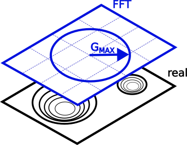
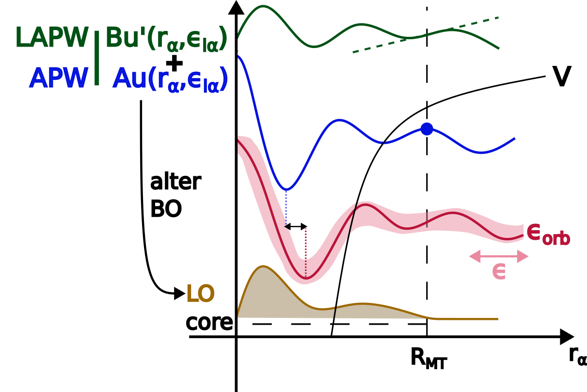

# Part III: Numerical precision in _ab initio_ calculations.

In this part, you will learn about several new quantities and tools for working with numerical-precision settings in NOMAD.
These tools will help you

1. query for the level of precision or conformity that you need.
2. deploy extracted data into a notebook to start performing data science.

Note that _precision_ specifies how close a calculation's convergence is with respect to the complete basis set limit, and not necessarily experiments (that would be _accuracy_).
As such, it only really makes sense when comparing entries of the same system.
It is best thought of as _a filter that gets applied after you have already chosen your material and method of interest_.

Since these precision quantities are new and by times community-specific, this tutorial places the emphasis on their definitions.
By times it also briefly touches on the bare minimum of theoretical knowledge required to handle them, but mostly leaves the interested reader with references to follow up on.
There are also a couple of example instructions guiding you to a specific entry or for downloading processed data into a notebook.
Lastly, watch out for the boxes with a pencil sign. They delve deeper into some topics and can be skipped at the first reading.

## Lay-out of the Precision section

To start, go to the Entries overview page > FILTERS (side menu) > Precision.
To navigate to the Entries page, check out [Part I - Exploring NOMAD](part1.md#entries_section).
The side menu in front of you is ordered so it starts out very general ([**k-line Density**](#k_section), [**Code-specific Tier**](#tier_section))
and below the choice of **Basis Set**, only contains quantities specific to certain basis set types, e.g. [**Plane-wave Cutoff**](#val_section), [**APW Cutoff**](#val_section).
The same quantities can be found for each entry in their OVERVIEW page > DATA > **results** > **method** > **simulation** > **precision**.
Following along with the example below, make sure your precision settings are sensible by filtering down to a well-defined system (cubic-centered Actinium) via FILTERS > Material > Ac > only compositions that ... > sorting by **Formula**.

    <label>
        <input type="checkbox">
        
    </label>

Some quantities are so specific and / or verbose, that they are relegated to DATA.
This means that they do not show up in the side menu, nor the search bar.
[Muffin-tin spheres](#mt_section) gives an example of when it is interesting to check them out and how to do so.

## Reciprocal space {#k_section}

In periodic systems, the most universal numerical parameter is the integration of the reciprocal space, or k-space, and its sampling.
With the sampling points often being spaced at fixed intervals, one can define a homogeneous _k-density_
$= \frac{\text{no. k-points}}{||\text{k-lattice vector}||}$.
Then, as the k-density ramps up, the Bloch wavefunction converges. <!-- reference? -->
Each (periodic) axis has its own k-density, and though one normally tries to keep these constant among them, fluctuations may happen due the discretized nature of the k-point sampling.
To ensure that NOMAD users obtain data that meets their convergence needs, ***k-line density*** only shows the lowest density value.

Many codes only support 3-D unit cells.
Any lower-dimensional cases are then handled by introducing a physical separation (vacuum) between the otherwise periodic images, as well as reducing the k-point sampling to a minimum (1 grid point).
Such edge cases can cause false positives, i.e. unphysically low k-line densities, given our current definition.
NOMAD distinguishes dimensionality in `results.material.toplogy.dimensionality` and will therefore only provide a k-line density in a true 3-D case.
You may also expect lower-dimensional cases to be supported in the near future, where only periodic axes are accounted for.

    

!!! note "Band structure calculations"
    For their spatial resolution, band structures sample along line paths connecting several high-symmetry points instead of the reciprocal lattice vectors.
    Not only can each line path can have its own spacing, their projections onto the reciprocal lattice vectors will vary.
    In short, they deviate from the fixed spacing requirement, and therefore, NOMAD filters them out.
    Conceptually, this is fine, since k-line density's aim is provide context to convergence, where this type of sampling does not apply.

## Electronic Structure {#elec_section}

At the level of the unit cell, there are several paradigms on how to represent the electronic wavefunction.
In this tutorial, we explore basis sets that start from plane waves, which mathematically mix well with the Bloch convolution.
In particular, we address _projector-augmented waves_ (PAW) and _augmented plane waves_ (APW).
As their names suggest, both extend the regular plane waves in regions where convergence is slow, namely around atomic nuclei.

A big distinction between PAW and APW is where they each draw this divide:

- PAW: the deciding factor is the orbital energies, with those below a certain threshold accounted for in special-purpose pseudopotentials.
  More on this in [Pseudopotentials](#pseudo_section).
- APW: here the divide is spatial in nature.
  A (mostly) spherical region, i.e. the muffin-tin sphere, is drawn surrounding the nuclei.
  The valence electrons reside in interstitial region between these spheres. 

### Valence Electrons {#val_section}

The main parameter controlling the plane waves is the longest k-vector $\mathbf{G}^{max}$.
A basis set of plane waves is then generated at fixed intervals, i.e. the secondary parameter, up to $\mathbf{G}^{max}$.
Since the sampling is symmetric in each direction, the length, $||\mathbf{G}^{max}||$, suffices.
By convention, most plane wave (especially PAW) codes express the vector length in energy units, which NOMAD reports as ***plane-wave cutoff***,
$E^{max}_{cut} = \frac{\left(\hbar ||\mathbf{G}_{cut}^{max}||\right)^2}{2m_e}$.

    

In principle, one can follow the same reasoning for the APW paradigm.
However, the cutoff energy alone gives an incomplete view.
While in PAW the plane waves sample the whole supercell, in APW they are barred from the muffin-tin spheres.
The convention here is to compare the length of $G^{max}$ to the largest muffin-tin radius in reciprocal space, yielding the unit-less fraction, ***APW cutoff***,
$||\mathbf{R}_{MT}^{min}|| \cdot ||\mathbf{G}_{cut}^{max}||$.

    

NOMAD points out these differences by specifying the unit after the quantity name and between brackets.
For more detail, hover over the quantity name.

Both cutoff types can safely be increased to retrieve entries with progressively better converged valence electron wavefunctions.

!!! note "What about _grid spacing_?"
    At the moment, the mesh of the reciprocal or fast Fourier-transformed (FFT) space is not yet extracted.
    It is on the _planned feature_ list, though with low priority, considering that most of the convergence is already captured by the cutoff.
    If an upload or analysis ever requires a new feature, feel free to reach out to us via [fairmat@physik.hu-berlin.de](fairmat@physik.hu-berlin.de).

### Core Electrons

The mathematical parameters describing the electronic core region are extracted, but do not appear in the side menu. <!-- core-electron treatment still exists in DFT -->
To access them, select an entry, e.g. type `entry_id = zxhFQjN5Mny1FW5QEOGxWLPThF3r` in the search bar > OVERVIEW > DATA.
In the DATA browser follow **run** (all computational data) > **method** ( metadata describing the calculation setup) > **electrons_representation**.
This sections contains metadata on the mathematical description of the electronic structure.

    <label>
        <input type="checkbox">
        
    </label>

Each representation comes with a **scope** and a **type**, which specify the entity (e.g. wavefunction, density, exchange-correlation density, integration grid) and the overall basis set, respectively.
Hardly any code sticks to a single set of parameters values, instead adapting them according to task at hand.
For this reason there can be multiple electrons representations, each with their unique scope.
Those reported in the search are always the settings for `scope = wavefunction`.

As you have learned in [Electronic Structure](#elec_section), some basis sets divide the orbital set into widely different approaches.
Each **basis_set** subsection describes and individual region.
Here too, you will find **scope** and **type** with pretty much the same definitions.
Take note though, since the basis set **scope** refers to the region it encodes.
Examples include cases mentioned above, based on

- orbital energy: _core_ vs _valence_.
- spatial boundaries: _muffin-tin_ vs _interstitial_
- Hamiltonian: _kinetic_ and _electron-nucleus_ interaction vs _electron-electron_ interaction in the case of CP2k's Quickstep algorithm.

#### Muffin-tin spheres {#mt_section}

APW is an all-electron approach, meaning that all orbitals are relaxed during an electronic self-consistent (SCF) routine.
By itself, APW is no longer state-of-the-art and has been followed up by extensions such as LAPW, SLAPW, and APW+lo.
Throughout this tutorial, the term _APW_ is used as a shorthand for this entire family of approaches, but in this section alone, it will refer to just the progenitor.

While a full overview of the theory is beyond the scope of this tutorial, a quick rundown is necessary to explain some of the NOMAD design choices.
The muffin-tin potential around the nucleus $\alpha$ allows the code to fall back on a more simple, spherically symmetric Hamiltonian to solve.
The basis set thus consists out of the harmonics $Y_L\left(r_\alpha\right)$ with radially dependent weights $u\left(r_\alpha, \epsilon\right)$.
In the original APW approach, the energy parameter $\epsilon$ is a variable that should converge to the respective orbital energies.
The core states then align with the well-known case of a multi-electron atom system and are tackled separately from the valence states. [@gulansExcitingFullpotentialAllelectron2014]

The muffin-tin valence bands, meanwhile, have to match with their plane-wave counterparts at the boundary.
While this formulation of APW is complete, it leads to a set of non-linear equations.
More modern implementations linearize these equations by freezing the energy parameter $\epsilon_{l,\alpha}$ by nucleus and harmonic index $l$. [@gulansExcitingFullpotentialAllelectron2014] [@singhPlanewavesPseudopotentialsLAPW2006]
Obviously, a single $\epsilon_{l,\alpha}$ value per $l$-channel cannot account for dispersion and (anti-)bonding effects, unless they match the state energy perfectly.
Instead, corrections are worked in by adding higher-order derivatives of $u\left(r_\alpha, \epsilon\right)$ to the basis set.
Likewise, each derivative order must also match up at the boundary.
If the corrections run up to first-order, the approach is called LAPW, else SLAPW for those beyond.

Another effect of constraining the energy parameter $\epsilon$ to $l$, is that it cannot account for wavefunctions with different nodes or main quantum numbers $n$.
Some core states, however, are too high-energy to be well-contained within their muffin-tin spheres.
They are typically referred to as _semicore_ and have to be treated as valence states.
The preferred way to tackle them, is by adding an additional wavefunction, similar to LAPW or SLAPW, but with a normalization requirements in lieu of some boundary constraints.
These are called _local orbitals_ (lo) and can be freely added by the user to supplement APW or LAPW.
By no means are they restricted to describing semicore states, but can also tackle additional _unoccupied states_ (used in beyond-DFT) as well.

    

While some APW codes require a manual setup for each orbital, e.g. Wien2k, others use a couple of "steering" parameters to generate the orbitals.
In NOMAD, we typically to keep parameters as concise as possible, though in this case this is not practical for two reasons:

1. There is no consensus on which steering parameters to use. Each code allows different levels of customization.
2. The energy parameters provided by the user should not be directly used in the SCF routines.
   Rather, the code will have some algorithm that optimizes the initial energy parameters based on the geometry.
   As such, any orbital degeneracy is lifted.

To capture the orbitals states completely, NOMAD instead "unrolls" the steering parameters down to individual radial valence orbitals, identified by their _type_ (e.g. APW, LAPW, lo), associated _harmonic index_ $l$, _derivative order_ of $u\left( r \right)$, and of course, the initial energy parameter guess.
The _sampling grid_ inside the muffin-tin region, as well as the _treatment of the core electrons_ are all specified at the basis set level.

!!! note "Uploading the right files"
    Most APW codes leave the orbital specification out of their main input file.
    Similarly, they will also write out their actual initial guesses for the energy parameters out to another intermediate file.
    If you want NOMAD to pick up on these parameters, please include the files in the table below into your upload.
    They are automatically generated, so there are no extra steps involved.

    code name | file name
    ----------|----------
    _exciting_| `<species>.xml`
    fleur     | `out.xml` (the main output file)
    Wien2k    | `<calculation>.inc1`
    Elk       | Not supported yet

#### Pseudopotentials {#pseudo_section}

With the exception of APW, most plane wave codes hide the core structure via an effective potential for the valence electrons.
Where most of these older pseudopotentials where constrained in their range of applications, those built for projector-augmented waves exhibit the highest degree of flexibility.

Where before NOMAD would simply indicate the usage of pseudopotentials, it now gives a more complete description, such as:
the _title_, the _density functional_ (or sometimes GW) used to generate the pseudopotential, _projector_ information, the recommended _minimum plane wave cutoff_ to be used for the valence electrons, and whether or not it is _norm-conserving_.
The latter is a useful (but more expensive) integration property and is a prerequisite for some methods. 
To try this out for yourself, look up `entry_id = zz7J6c9cn_K5B4Ecbiasy4xQ-hYl` and navigate to OVERVIEW > DATA > **run** > **method** > **atom_parameters** (describes the calculation setup by elemental type) > **pseudopotential**.

!!! note "Why am I seeing double quantities?"
    The NOMAD metainfo is semantically constructed. Consequentially, a quantity may belong under several categories.
    In this case, they always share the same name and definition though.
    Meanwhile, some quantities (e.g. **pseudopotential** vs **pseudopotential_name**) may appear to be similar, but are not exactly identical.
    Likely, one of them is legacy (**pseudopotential_name**). The legacy quantity will then be deprecated, though their actual removal may be scheduled later for compatibility reasons.

!!! note "Disclaimer"
    At the moment, parsing is restricted to VASP pseudopotentials, including non-standard or self-made versions.
    Wider code-support is being built out.
    NOMAD takes great care in complying with the copyright of the standard POTCAR files and their distribution, so all instances are stripped down to their metadata alone.

## Code-specific tiers {#tier_section}

Filtering for the aforementioned quantities requires quite some expertise, and it is hard often to weigh the significance of two parameters in the electronic convergence.
Some codes have benchmarked their own suggested settings into a list of increasing precision, i.e. _tiers_.
Tiers provide the user base with a relatively safe reference, without having to run any benchmarks themselves.
Consequentially, they facilitate standardization and interoperability among users and / or publications.
Typically, lower tiers are used to save on resources when exploring large materials' spaces and running large or long simulations.
They can also act as starting points for higher tiers that provide high-quality data.

Essentially, these tiers hide the high-dimensional parameter values behind a set of hierarchical categories.
One such good example of this complexity can be found in `entry_id = z-wO_IzCW9sDvysmF500duxvDXDs`.
The section `run.method.electrons_representation` contains the corresponding settings.
To view all quantities, including those unique to the code, select _code specific_ in the upper-right corner.
These are hidden by default.

Back in the Entries overview page, you can filter by tier by typing `<code name> - <tier name>` (e.g. `VASP - accurate`) into the NOMAD side menu > Precision > Code-specific Tier.
`<code name>` is integral to the format, because tiers are code-specific.
This quantity is not meant to provide some kind of comparison across codes.
`<tier name>`, meanwhile, is case-sensitive, but suggestions will pop up once you start typing.

Overall, ***Code-specific tier*** captures a lot of complexity at once, making it great for quick searches.
Beware though: it is also very picky, and will strongly reduce the number of entries returned.

!!! note "Tier matching"
    Contrary to other precision quantities like k-line density, plane-wave cutoff, or APW cutoff, tiers are discrete, not continuous.
    Settings between two tiers are hard to pin down, even qualitatively, since the setting parameters have differing weights.
    Therefore, NOMAD only assigns perfect matches.
    When even one value in the settings is altered by the user, the calculation is immediately disqualified from the tier.
    This does not mean that the data is invalid or less valuable, though, just that it will be not show up when the filter is applied.
